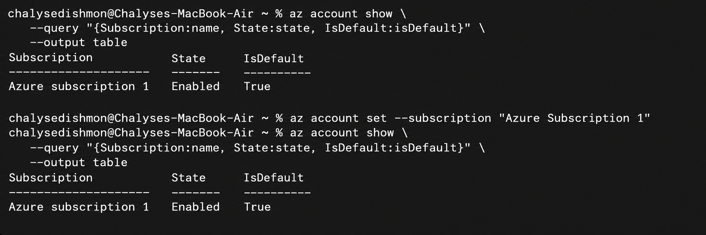
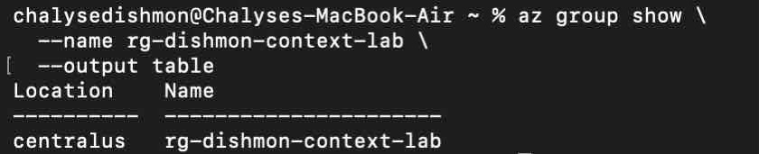
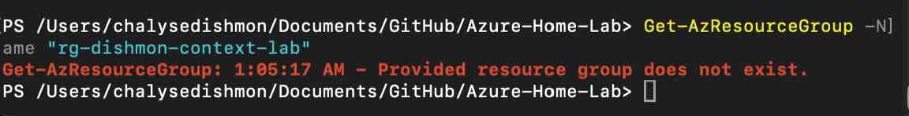

# Reconstructed Lab – Azure PowerShell, Azure CLI & Subscription Context

## Overview

This reconstructed lab documents foundational Azure administration skills completed before the numbered portfolio lab sequence.

The focus was on using **Azure PowerShell** and **Azure CLI** to verify the active Azure subscription, understand subscription context, confirm that resources were being managed in the intended subscription, and clean up a temporary resource group afterward.

These skills are important because many Azure administration commands act against the **currently selected subscription context**. Verifying context before creating, modifying, or deleting resources helps prevent changes in the wrong subscription.

---

## Objectives

- Review Azure PowerShell and Azure CLI command structure
- Verify the current Azure PowerShell subscription context
- List subscriptions available to the signed-in account
- Verify the active Azure CLI subscription
- Explicitly set the Azure CLI subscription context
- Confirm a temporary resource group exists in the expected subscription
- Remove the temporary resource group
- Verify cleanup from Azure PowerShell
- Reinforce safe subscription-context habits before resource deployment

---

## Azure Administration Tools

| Tool | Purpose in This Lab |
|---|---|
| Azure PowerShell | Checked Azure context and verified resource cleanup |
| Azure CLI | Reviewed and set subscription context and verified the resource group |
| Azure subscription context | Determines which subscription receives management operations |
| Resource group | Temporary Azure resource used to verify the selected subscription |

---

## PowerShell vs. Azure CLI

Both Azure PowerShell and Azure CLI manage the same Azure platform, but they use different command styles.

### Azure PowerShell

Azure PowerShell follows the PowerShell **Verb-Noun** model.

Examples:

```powershell
Get-AzContext
Get-AzSubscription
Get-AzResourceGroup
Set-AzContext
Remove-AzResourceGroup
```

Common verbs include:

```text
Get-
New-
Set-
Remove-
```

### Azure CLI

Azure CLI generally follows:

```text
az <service/group> <action>
```

Examples:

```text
az account list
az account show
az account set
az group show
az group delete
```

The syntax is different, but both tools send management requests to Azure.

---

## 1. Verify Subscription Context

Before deploying or deleting Azure resources, the active subscription should be verified.

With Azure PowerShell:

```powershell
Get-AzContext
```

This shows the **current Azure PowerShell context**, including the active subscription.

To see the subscriptions available to the account:

```powershell
Get-AzSubscription
```

The important distinction is:

```text
Get-AzContext
    |
    +--> Which subscription am I using right now?

Get-AzSubscription
    |
    +--> Which subscriptions are available to me?
```

This distinction is useful for AZ-104 because a user can have access to multiple subscriptions while only one subscription is active for the current command context.

---

## 2. Verify and Set Azure CLI Context

Azure CLI provides similar subscription-management commands.

```text
az account list
```

lists subscriptions available to the signed-in Azure CLI session.

```text
az account show
```

shows the currently selected subscription.

The active subscription can be explicitly selected with:

```text
az account set --subscription "<subscription-name-or-id>"
```



> **Portfolio note:** This first image is a sanitized reconstructed command view based on the commands practiced in the lab. Subscription and tenant identifiers were intentionally omitted. It is included as an illustrative command reference rather than as raw execution evidence.

### Why Context Matters

If an administrator runs a deployment command while the wrong subscription is active, Azure can create resources in the wrong billing, governance, RBAC, or operational boundary.

A safe workflow is:

```text
Authenticate
    |
    v
Verify subscription
    |
    v
Set subscription if required
    |
    v
Verify again
    |
    v
Create / modify / delete resources
```

---

## 3. Verify the Resource Group with Azure CLI

A temporary resource group named:

```text
rg-dishmon-context-lab
```

was used to validate the selected subscription.

Azure CLI successfully returned the resource group:

```text
Name:     rg-dishmon-context-lab
Location: centralus
```



This confirmed that Azure CLI was operating against the subscription containing the lab resource.

---

## 4. Cleanup Verification with Azure PowerShell

After the temporary resource group was removed, Azure PowerShell was used to verify that it no longer existed.

The verification command was:

```powershell
Get-AzResourceGroup -Name "rg-dishmon-context-lab"
```

Azure returned:

```text
Provided resource group does not exist.
```



In this context, the message is expected and useful because it proves the temporary lab resource group was successfully removed.

---

## Cross-Tool Verification

A useful part of this lab was using both Azure CLI and Azure PowerShell against the same Azure environment.

The workflow demonstrated:

```text
Azure CLI
    |
    +--> Verify selected subscription
    |
    +--> Confirm resource group exists
    |
    v
Azure Resource Manager
    ^
    |
    +--> Verify cleanup
    |
Azure PowerShell
```

This reinforces that Azure CLI and Azure PowerShell are different administration interfaces for the same Azure control plane.

---

## Key Lessons Learned

- Always verify the active subscription before performing Azure administration tasks.
- `Get-AzContext` shows the current Azure PowerShell context.
- `Get-AzSubscription` lists subscriptions available to the account.
- `az account list` lists Azure CLI subscriptions.
- `az account show` displays the current Azure CLI subscription.
- `az account set` changes the Azure CLI subscription context.
- Azure PowerShell uses Verb-Noun cmdlet naming.
- Azure CLI uses a service/group plus action command structure.
- PowerShell and CLI can be used against the same Azure environment when the correct context is selected.
- Resource verification should be performed before and after cleanup.
- A “resource does not exist” result can be valid verification after intentional deletion.
- Explicit context checks reduce the risk of deploying or deleting resources in the wrong subscription.

---

## AZ-104 Concepts Practiced

This lab reinforced Azure Administrator concepts including:

- Azure subscriptions
- Subscription context
- Azure PowerShell
- Azure CLI
- `Get-AzContext`
- `Get-AzSubscription`
- `Set-AzContext`
- `az account list`
- `az account show`
- `az account set`
- Resource groups
- Resource verification
- Resource cleanup
- Cross-tool Azure administration
- Safe deployment practices

---

## Verification Results

The following objectives were successfully verified:

- Azure PowerShell context concepts reviewed
- Available subscriptions reviewed
- Azure CLI subscription context reviewed
- Active Azure CLI subscription explicitly selected
- Temporary resource group confirmed with Azure CLI
- Temporary resource group removed
- Cleanup verified with Azure PowerShell
- No temporary lab resources were left running

---

## Portfolio Evidence

1. **Azure CLI Subscription Context**  
   Sanitized reconstructed command reference showing how the active subscription is verified and selected without exposing subscription or tenant identifiers.

2. **Resource Group Visible in Azure CLI**  
   Demonstrates that `rg-dishmon-context-lab` existed in the selected Azure context.

3. **Resource Group Cleanup Verified with Azure PowerShell**  
   Demonstrates post-cleanup verification by confirming that the temporary resource group no longer exists.

---

## Repository Structure

```text
00-Azure-PowerShell-CLI-Subscription-Context/
├── README.md
└── screenshots/
    ├── 01-azure-cli-subscription-context.png
    ├── 02-resource-group-visible-cli.jpg
    └── 03-resource-group-cleanup-verified-powershell.jpg
```
