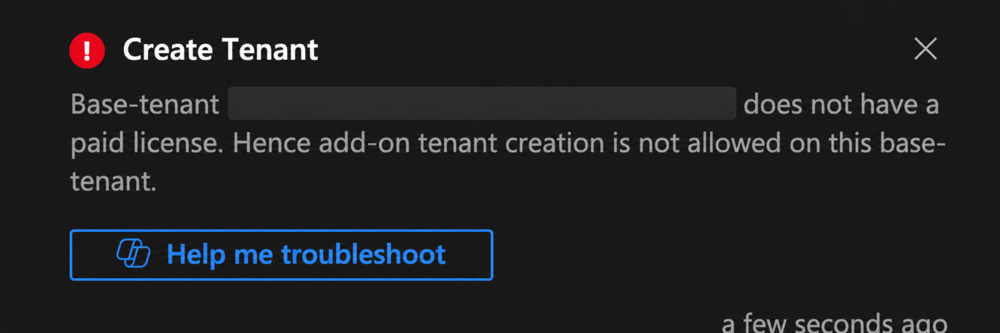
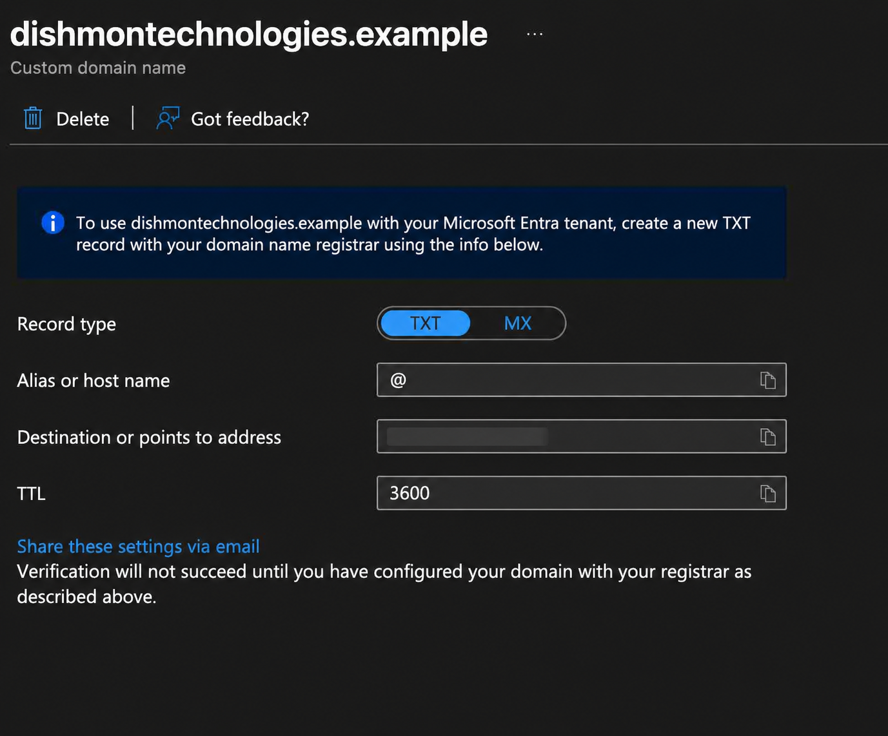
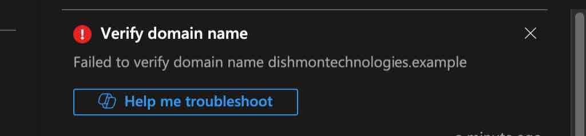
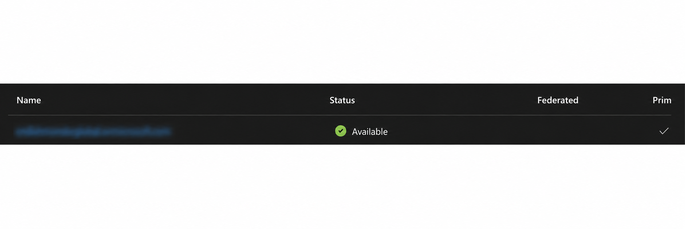

# Reconstructed Lab – Microsoft Entra ID Tenants & Custom Domains

## Overview

This reconstructed lab documents foundational **Microsoft Entra ID tenant and custom-domain administration** completed before the later numbered portfolio labs.

The lab focused on understanding the relationship between Microsoft Entra tenants and Azure subscriptions, reviewing tenant creation behavior, working with tenant/domain settings, and practicing the DNS ownership-verification process required before a custom domain can be used with Microsoft Entra ID.

The lab also included troubleshooting when tenant creation and custom-domain verification did not succeed on the first attempt.

---

## Objectives

- Review the purpose of a Microsoft Entra tenant
- Understand the relationship between tenants and Azure subscriptions
- Review tenant-creation requirements and restrictions
- Recognize that one tenant can be associated with multiple Azure subscriptions
- Review directory / tenant switching concepts
- Examine the default `onmicrosoft.com` domain
- Add a custom domain to Microsoft Entra ID
- Review the TXT-record ownership-verification process
- Troubleshoot failed custom-domain verification
- Verify the domain after the required ownership proof was corrected
- Reinforce the difference between Azure RBAC roles and Microsoft Entra directory roles

---

## Microsoft Entra Tenant vs. Azure Subscription

A **Microsoft Entra tenant** is the identity boundary for an organization.

It contains identity-related objects such as:

- Users
- Groups
- Applications
- Service principals
- Microsoft Entra directory roles
- Verified domain names

An **Azure subscription** is a billing, resource-management, and governance boundary.

A useful way to remember the relationship is:

```text
Microsoft Entra tenant
        |
        +--> Azure Subscription 1
        +--> Azure Subscription 2
        +--> Azure Subscription 3
```

A tenant can be associated with multiple Azure subscriptions.

This distinction matters because identity and resource authorization are related, but they are not the same thing.

---

## Microsoft Entra Roles vs. Azure RBAC

This lab reinforced an important AZ-104 distinction:

```text
Microsoft Entra directory role
        |
        +--> Manages identity / directory operations

Azure RBAC role
        |
        +--> Manages access to Azure resources
```

For example:

- A Microsoft Entra directory role can control directory-level identity administration.
- An Azure RBAC role assignment controls what a principal can do at a management group, subscription, resource group, or resource scope.

---

## 1. Tenant Creation Restriction

An attempt to create an additional Microsoft Entra tenant was blocked because the base tenant did not meet the licensing requirement shown by the portal.

The portal returned a tenant-creation restriction indicating that add-on tenant creation was not allowed for the current base tenant.



### Administrative Lesson

Tenant creation is not always available simply because an administrator can access the Microsoft Entra portal.

Tenant creation behavior can depend on current Microsoft requirements, licensing, permissions, and organizational controls.

The important troubleshooting approach is:

```text
Attempt tenant creation
        |
        v
Portal rejects request
        |
        v
Read the actual restriction
        |
        v
Determine whether the issue is:
licensing, permissions, or tenant policy
```

---

## 2. Custom Domain Ownership Verification

Microsoft Entra ID requires proof that the organization controls a custom DNS domain before that domain can be used for identities.

The portal provided DNS verification information using a **TXT record**.

The configuration included:

```text
Record type: TXT
Host / alias: @
TTL: 3600
```



The portal also provided a Microsoft-generated verification value that had to be published through the domain's DNS provider.

### Why the TXT Record Matters

Adding a name to the Microsoft Entra portal does not prove ownership.

The workflow is:

```text
Add custom domain in Microsoft Entra
        |
        v
Microsoft provides verification value
        |
        v
Create TXT record in public DNS
        |
        v
Wait for DNS propagation
        |
        v
Microsoft queries DNS
        |
        v
Domain ownership verified
```

This protects organizations from claiming domain names that they do not control.

---

## 3. Failed Domain Verification

The first verification attempt failed.



This was expected troubleshooting evidence because Microsoft Entra cannot complete verification until the required DNS record is available and matches the verification value expected by the tenant.

### Common Reasons Verification Can Fail

Possible causes include:

- TXT record was not created
- TXT value was entered incorrectly
- Record was created at the wrong DNS host/name
- DNS changes had not propagated yet
- The wrong domain was being verified
- The record existed in a DNS zone that was not authoritative for the domain

The key lesson is that the failure is normally a **DNS ownership-proof problem**, not an Azure RBAC problem.

---

## 4. Domain Verification Completed

After correcting the domain-verification requirement, the domain reached a verified state in Microsoft Entra ID.



This completed the custom-domain administration workflow.

Once a custom domain is verified, Microsoft Entra can recognize it as an approved domain for tenant identity scenarios.

---

## Default Domain vs. Custom Domain

Every Microsoft Entra tenant receives a default domain similar to:

```text
organization.onmicrosoft.com
```

A custom domain allows organizations to use a more business-friendly domain for identities.

Conceptually:

```text
Default tenant domain
organization.onmicrosoft.com

            vs.

Verified custom domain
company.example.com
```

The default domain exists automatically with the tenant, while a custom domain requires ownership verification.

---

## Tenant and Subscription Context

Another important concept reinforced by this lab is that switching Azure subscriptions and switching Microsoft Entra tenants are different operations.

```text
Switch subscription
        |
        +--> Changes Azure resource context

Switch tenant / directory
        |
        +--> Changes Microsoft Entra directory context
```

A tenant may contain multiple subscriptions, so administrators should always verify both the **directory** and the **subscription** when working across multiple Azure environments.

---

## Troubleshooting Summary

The lab included two useful administration problems:

```text
Tenant creation failed
        |
        v
Licensing / tenant-creation restriction identified
```

and:

```text
Custom-domain verification failed
        |
        v
DNS ownership verification reviewed
        |
        v
Verification requirement corrected
        |
        v
Domain verified
```

Both reinforce a core Azure administration habit:

> Read the actual platform error, determine which control plane is involved, and verify the dependency before changing unrelated settings.

---

## Key Lessons Learned

- A Microsoft Entra tenant is an identity boundary.
- An Azure subscription is a resource-management and billing boundary.
- One Microsoft Entra tenant can be associated with multiple Azure subscriptions.
- Switching subscriptions is not the same as switching Microsoft Entra directories.
- Tenant creation can be restricted by licensing, permissions, or organizational controls.
- Every Microsoft Entra tenant has a default `onmicrosoft.com` domain.
- Custom domains must be verified before Microsoft Entra will trust them.
- TXT records are commonly used to prove DNS-domain ownership.
- DNS verification can fail because of incorrect records or propagation delays.
- A custom-domain verification failure is not automatically an RBAC problem.
- Microsoft Entra directory roles and Azure RBAC roles serve different purposes.
- Identity context and Azure resource context should both be checked when administering multiple environments.

---

## AZ-104 Concepts Practiced

This lab reinforced Azure Administrator concepts including:

- Microsoft Entra ID
- Microsoft Entra tenants
- Azure subscriptions
- Tenant / directory context
- Subscription-to-tenant relationships
- Microsoft Entra directory roles
- Azure RBAC roles
- Default tenant domains
- Custom domain names
- DNS ownership verification
- TXT records
- DNS propagation
- Tenant creation restrictions
- Identity administration troubleshooting

---

## Verification Results

The following objectives were successfully completed:

- Microsoft Entra tenant concepts reviewed
- Tenant and subscription relationship reviewed
- Tenant-creation restriction identified
- Default tenant-domain behavior reviewed
- Custom-domain verification workflow configured
- TXT ownership-verification requirement reviewed
- Failed domain verification observed and troubleshot
- Final domain verification confirmed
- Temporary test-domain configuration cleaned up when no longer required

---

## Portfolio Evidence

1. **Tenant Creation License Restriction**  
   Demonstrates a real Microsoft Entra tenant-creation restriction and the need to understand current platform requirements.

2. **Custom Domain TXT Verification**  
   Demonstrates the DNS information Microsoft Entra provides to prove domain ownership.

3. **Custom Domain Verification Failed**  
   Demonstrates troubleshooting when ownership verification is not yet satisfied.

4. **Custom Domain Verified**  
   Demonstrates successful completion of the domain-verification workflow.

---

## Repository Structure

```text
00B-Microsoft-Entra-ID-Tenants-Custom-Domains/
├── README.md
└── screenshots/
    ├── 01-tenant-creation-license-restriction.png
    ├── 02-custom-domain-txt-verification.png
    ├── 03-custom-domain-verification-failed.jpg
    └── 04-custom-domain-verified.png
```
