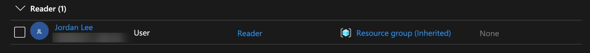
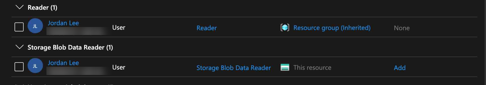
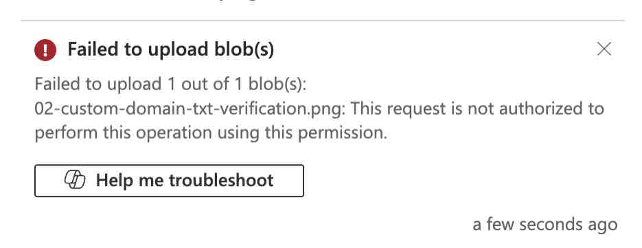
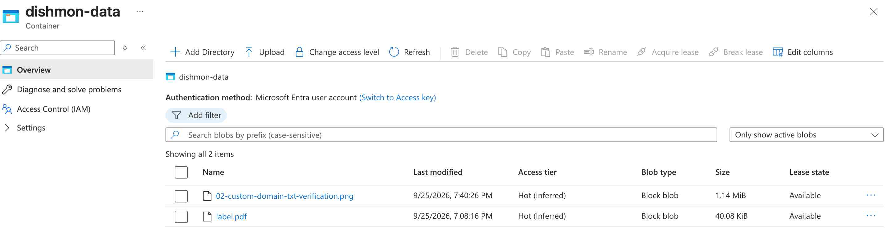
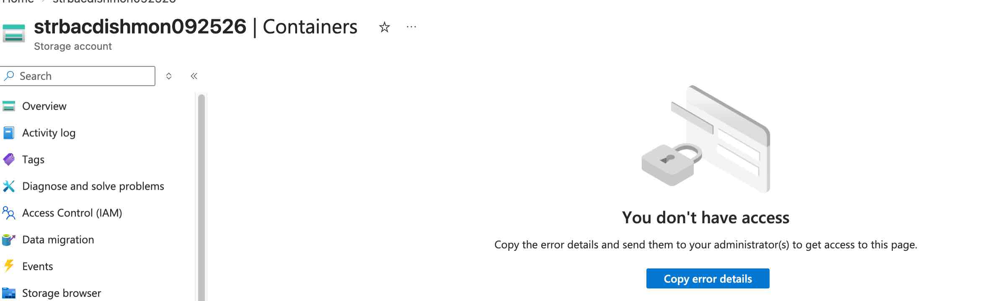

# Reconstructed Lab – Azure RBAC, Scope & Storage Authorization

## Overview

This reconstructed lab documents hands-on practice with **Azure Role-Based Access Control (RBAC)**, scope inheritance, storage authorization, and custom roles in the fictional **Dishmon Technologies** environment.

The lab was designed to demonstrate a key Azure administration concept:

> Being able to see or manage an Azure resource does not automatically mean a user can access the data inside that resource.

Using a test user named **Jordan Lee**, the lab compared management-plane access with blob data-plane access and verified how different Azure roles affected what the user could actually do.

---

## Objectives

- Review Azure RBAC roles and scope
- Understand inherited role assignments
- Compare Reader, Contributor, and Owner
- Distinguish Azure resource access from storage data access
- Assign `Storage Blob Data Reader`
- Verify read-only blob access
- Confirm that `Storage Blob Data Reader` does not permit uploads
- Assign `Storage Blob Data Contributor`
- Verify successful blob upload
- Create and assign a custom RBAC role
- Observe that a custom management role does not automatically grant blob data access
- Remove the custom role after testing
- Apply least-privilege access principles

---

## Core Azure RBAC Concepts

Azure RBAC controls access to Azure resources by combining:

```text
Security principal
      +
Role definition
      +
Scope
      =
Role assignment
```

A **security principal** can be a user, group, service principal, or managed identity.

A **role definition** describes which actions are allowed.

A **scope** determines where the assignment applies.

Common scopes include:

```text
Management group
      ↓
Subscription
      ↓
Resource group
      ↓
Resource
```

Permissions assigned at a higher scope can be inherited by resources below that scope.

---

## 1. Inherited Reader Access

Jordan Lee received the built-in **Reader** role through a resource-group-level assignment.

The storage resource displayed the role as:

```text
Reader
Scope: Resource group (Inherited)
```



This demonstrates RBAC inheritance.

Because Reader was assigned at the resource group, Jordan inherited read access to resources contained within that resource group.

### Reader Role

The Reader role allows a user to:

```text
View Azure resources
View resource configuration
View resource metadata
```

but it does not grant permission to modify those Azure resources.

More importantly for this lab, **Reader alone does not grant permission to read blob contents**.

---

## 2. Management Plane vs. Data Plane

Storage accounts are a strong example of the difference between Azure's management plane and data plane.

### Management Plane

The management plane handles the Azure resource itself.

Examples include:

```text
View the storage account
View configuration
View networking settings
View IAM
Manage resource properties
```

Azure RBAC roles such as:

```text
Reader
Contributor
Owner
```

primarily control management-plane operations.

### Data Plane

The data plane controls the actual data stored inside the service.

For Blob Storage, this includes:

```text
List blobs
Read blob contents
Upload blobs
Modify blobs
Delete blobs
```

Those operations require appropriate **Storage Blob Data** roles when Microsoft Entra authentication is used.

---

## 3. Storage Blob Data Reader

Jordan was assigned:

```text
Storage Blob Data Reader
```

at the storage resource.

The effective role assignments then showed both:

```text
Reader
    Scope: Resource group (Inherited)

Storage Blob Data Reader
    Scope: This resource
```



This illustrates that a user can have multiple role assignments at different scopes.

### Effective Result

Jordan could:

```text
View the storage account
Access blob data
Read existing blobs
```

but could not upload new blobs.

---

## 4. Upload Denied with Storage Blob Data Reader

An upload was attempted while Jordan had `Storage Blob Data Reader`.

Azure returned:

```text
Failed to upload blob(s)

This request is not authorized to perform this operation
using this permission.
```



This was the expected result.

The key distinction is:

```text
Storage Blob Data Reader
        |
        +--> Read blob data
        |
        X--> Upload / modify blob data
```

This is a common AZ-104 scenario because the role name accurately describes the allowed data operation: **Reader** means read-only.

---

## 5. Storage Blob Data Contributor

To allow uploads, Jordan required a role that included blob write permissions.

`Storage Blob Data Contributor` was assigned.

After the role assignment propagated, Jordan was able to upload a blob successfully.



The container showed the uploaded objects, confirming that the write operation succeeded.

### Storage Blob Data Reader vs. Contributor

| Role | Read blob data | Upload / modify blob data | Delete blob data |
|---|---:|---:|---:|
| Storage Blob Data Reader | Yes | No | No |
| Storage Blob Data Contributor | Yes | Yes | Yes |

The lab demonstrated why role selection should match the actual business requirement.

---

## 6. Resource Access Does Not Equal Data Access

Another test demonstrated that a user could have access to the Azure resource itself while still being denied access to the container data.

The portal displayed:

```text
You don't have access
```

when attempting to open the container.



This reinforces the management-plane vs. data-plane distinction.

A user may have enough RBAC permission to see the storage account resource but still require a separate storage data role to interact with blobs.

---

## 7. Custom RBAC Role

A custom RBAC role was also created and assigned during the lab.

After the custom role assignment, Jordan could view the storage account overview but could not access the blob container.

This demonstrated that a custom role only grants the permissions explicitly included in its role definition.

Creating a custom role does **not** automatically include storage data-plane permissions.

Conceptually:

```text
Custom management permissions
        |
        v
Can view / manage selected Azure resource operations

        does not automatically mean

Blob data access
```

If blob access is required, the custom role must include the appropriate data actions, or a built-in Storage Blob Data role must be assigned separately.

The custom role was removed after testing.

---

## 8. Reader vs. Contributor vs. Owner

The lab also reinforced the differences between three common built-in Azure roles.

### Reader

```text
Can view resources
Cannot make changes
Cannot assign RBAC access
```

### Contributor

```text
Can create and manage resources
Can delete resources
Cannot grant RBAC access to other users
```

### Owner

```text
Can create and manage resources
Can delete resources
Can grant RBAC access
```

The important distinction between **Contributor** and **Owner** is access management.

```text
Contributor
    = Manage resources

Owner
    = Manage resources + manage access
```

---

## 9. Scope and Inheritance

The lab used assignments at different scopes to reinforce how permissions flow through Azure.

For example:

```text
Resource group
    |
    +--> Reader assigned to Jordan
            |
            v
       Storage account
       inherits Reader
```

A role assigned at the storage-account resource itself applies only to that storage account and its relevant child resources.

This allows administrators to combine broader management permissions with narrower data permissions.

---

## Least-Privilege Design

The lab reinforced a practical least-privilege approach:

```text
Need to see Azure resource configuration?
        |
        v
Reader

Need to read blob contents?
        |
        v
Storage Blob Data Reader

Need to upload / modify blob contents?
        |
        v
Storage Blob Data Contributor

Need to manage Azure resources?
        |
        v
Contributor

Need to manage resources and RBAC access?
        |
        v
Owner
```

The correct role is the narrowest role that satisfies the required task.

---

## Troubleshooting Workflow

The access troubleshooting process can be summarized as:

```text
User cannot perform action
        |
        v
Identify the operation
        |
        +--> Management-plane action?
        |
        +--> Data-plane action?
        |
        v
Check role assignment
        |
        v
Check assignment scope
        |
        v
Check inheritance
        |
        v
Compare role permissions to required action
        |
        v
Assign least-privilege role
        |
        v
Verify behavior
```

This is more reliable than simply assigning a broader role such as Owner.

---

## Key Lessons Learned

- Azure RBAC permissions are assigned to a security principal at a specific scope.
- Role assignments can be inherited from parent scopes.
- Lower scopes can receive additional role assignments without changing inherited roles.
- Reader provides Azure resource visibility but does not automatically provide blob data access.
- Storage Blob Data Reader allows blob reads but not uploads.
- Storage Blob Data Contributor allows blob read/write/delete operations.
- Management-plane roles and data-plane roles solve different authorization problems.
- Contributor can manage resources but cannot grant RBAC access.
- Owner can manage resources and grant access.
- Custom roles only provide the actions and data actions explicitly defined in the role.
- A custom management role does not automatically grant storage data access.
- Least privilege should be used instead of assigning broad permissions to solve access problems.
- Access should always be verified by testing the actual operation the user needs to perform.

---

## AZ-104 Concepts Practiced

This lab reinforced Azure Administrator concepts including:

- Azure Role-Based Access Control
- Security principals
- Role definitions
- Role assignments
- RBAC scope
- RBAC inheritance
- Reader
- Contributor
- Owner
- Management plane
- Data plane
- Microsoft Entra authentication for storage
- Storage Blob Data Reader
- Storage Blob Data Contributor
- Storage authorization
- Custom RBAC roles
- Least-privilege access
- Effective access troubleshooting
- Role propagation and verification

---

## Verification Results

The following objectives were successfully verified:

- Jordan inherited Reader from the resource group
- Reader assignment was visible at the storage resource
- Storage Blob Data Reader was assigned at the storage-resource scope
- Jordan could read blob data
- Blob upload failed while Jordan had read-only data access
- Storage Blob Data Contributor was assigned
- Blob upload succeeded after the data-contributor role assignment
- Resource visibility and container-data access were demonstrated as separate permissions
- Custom RBAC role was created
- Custom role permitted selected management access without granting blob data access
- Custom role was removed after testing
- Temporary lab resources were cleaned up

---

## Portfolio Evidence

1. **Inherited Reader Role**  
   Demonstrates role inheritance from a resource group to a storage resource.

2. **Storage Blob Data Reader Assigned**  
   Demonstrates separate management-plane and data-plane role assignments at different scopes.

3. **Blob Upload Denied with Data Reader**  
   Demonstrates that read-only blob access does not permit uploads.

4. **Blob Upload Success with Data Contributor**  
   Demonstrates successful write access after assigning the appropriate storage data role.

5. **Storage Container Access Denied**  
   Demonstrates that Azure resource access does not automatically grant storage data access.

---

## Repository Structure

```text
02-RBAC/
└── reconstructed-scope-storage-authorization/
    ├── README.md
    └── screenshots/
        ├── 01-inherited-reader-role.png
        ├── 02-storage-blob-data-reader-assigned.png
        ├── 03-blob-upload-denied-data-reader.png
        ├── 04-blob-upload-success-data-contributor.png
        └── 05-storage-container-access-denied.png
```
