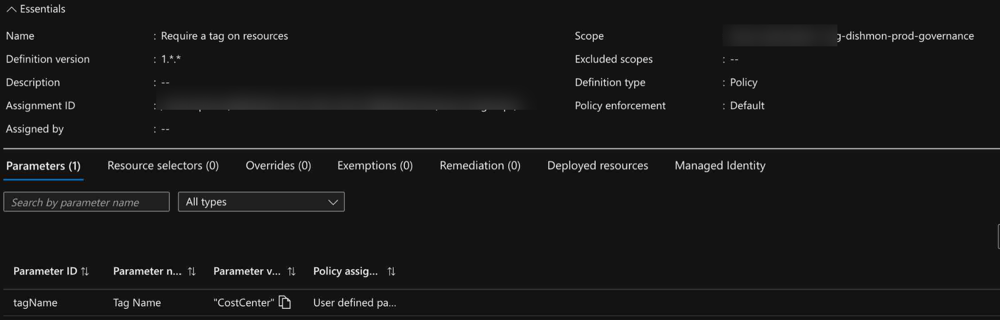
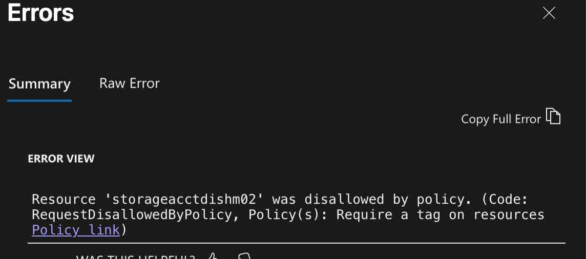
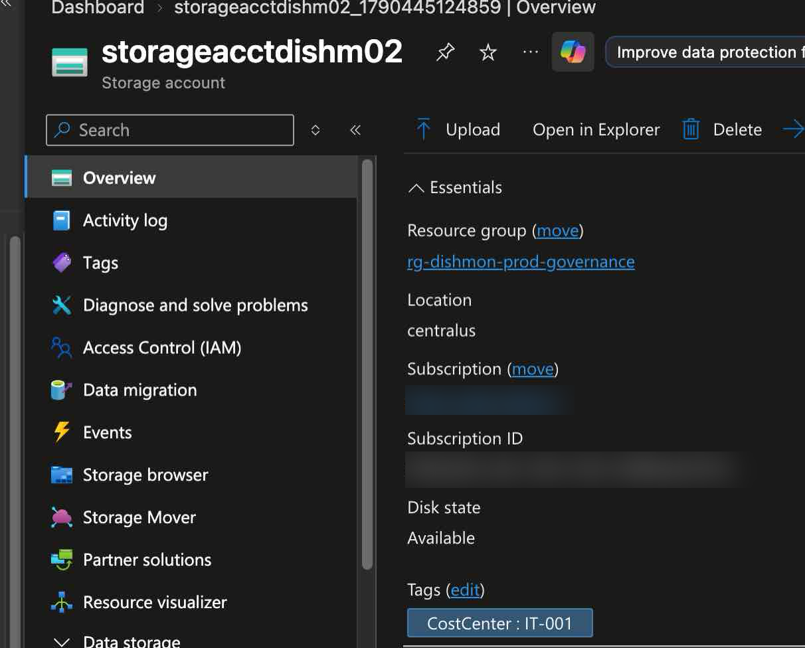
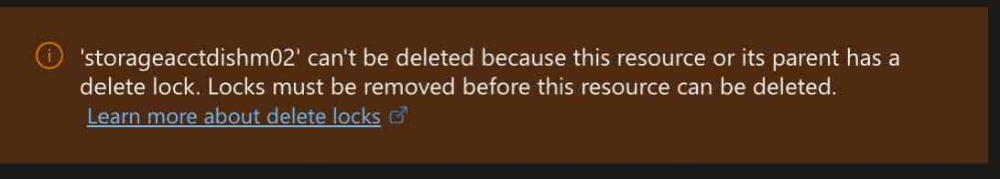
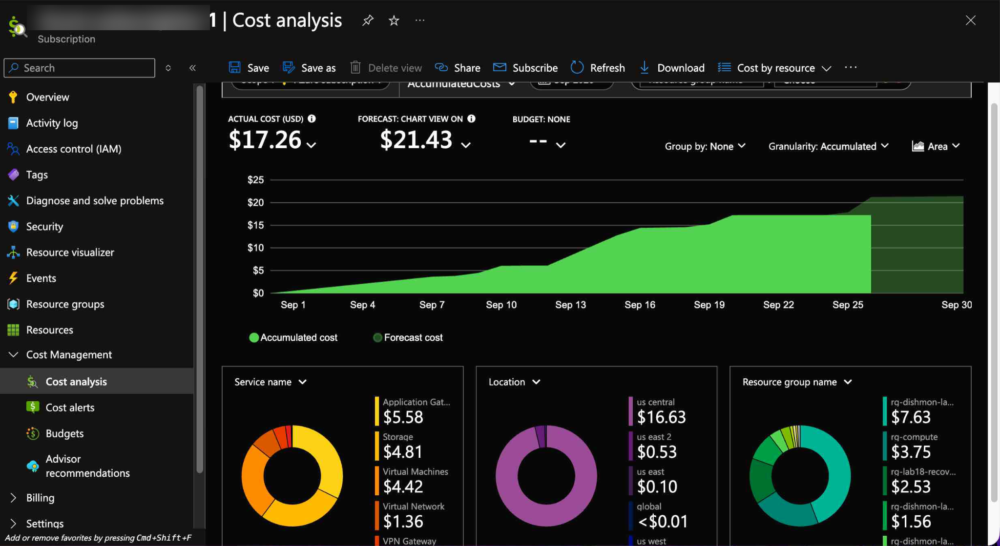

# Reconstructed Lab – Azure Governance, Policy, Locks & Cost Management

## Overview

This reconstructed lab documents hands-on Azure governance work in the fictional **Dishmon Technologies** environment.

The lab focused on using **Azure Policy**, **resource tags**, **resource locks**, and **Cost Management** to enforce organizational standards, protect resources from accidental deletion, and review Azure spending.

A key troubleshooting moment occurred when a storage account deployment was denied because the resource did not contain the required `CostCenter` tag. After correcting the tag, the resource became compliant with the assigned policy.

---

## Objectives

- Review Azure governance concepts
- Apply Azure Policy at an appropriate scope
- Require a specific resource tag
- Troubleshoot a policy-denied deployment
- Correct the required `CostCenter` tag
- Verify the resource after satisfying policy requirements
- Apply a delete lock
- Confirm that the lock blocks deletion
- Review Azure Cost Management and Cost Analysis
- Reinforce the relationship between subscriptions, resource groups, Policy, tags, locks, and management groups
- Clean up temporary lab resources after verification

---

## Azure Governance Components

| Component | Purpose |
|---|---|
| Azure Policy | Enforces or evaluates organizational standards |
| Policy assignment | Applies a policy definition at a selected scope |
| Tags | Add organizational metadata to Azure resources |
| Resource locks | Protect resources from accidental modification or deletion |
| Cost Management | Provides visibility into Azure spending and forecasts |
| Subscription | Billing and governance boundary containing Azure resources |
| Management group | Organizes subscriptions for governance at a higher scope |

---

## Governance Scope

Azure governance can be applied at different levels of the Azure hierarchy:

```text
Management Group
      ↓
Subscription
      ↓
Resource Group
      ↓
Resource
```

Policies and other governance controls assigned at a higher scope can affect resources below that scope.

This makes scope selection important: administrators should apply governance at the highest level that matches the intended requirement without affecting unrelated resources.

---

## 1. Assign a Required-Tag Policy

The lab used the built-in policy:

```text
Require a tag on resources
```

The policy was assigned to the governance resource group and configured with the required tag name:

```text
CostCenter
```



The policy assignment used the default enforcement behavior.

### Why This Matters

Tags can support:

- Cost allocation
- Ownership tracking
- Environment classification
- Department or business-unit identification
- Automation and reporting

A policy that requires a tag helps prevent resources from being created without the metadata needed by the organization.

---

## 2. Policy Denied a Non-Compliant Resource

An attempt to create the storage resource without the required tag was blocked.

Azure returned:

```text
RequestDisallowedByPolicy
```

and identified:

```text
Require a tag on resources
```

as the policy responsible for the denial.



This demonstrated that the policy was actively enforcing the governance requirement rather than simply reporting non-compliance.

---

## 3. Troubleshoot the Required Tag

During troubleshooting, the wrong tag name was initially used:

```text
Department
```

The policy required:

```text
CostCenter
```

The resource therefore remained non-compliant until the tag name matched the policy parameter exactly.

After correcting the configuration, the storage account contained:

```text
CostCenter: IT-001
```



### Key Lesson

Azure Policy evaluates the configured rule exactly.

A tag that is logically similar but uses a different name does not satisfy a policy that requires a specific tag key.

```text
Required by policy: CostCenter
Actual tag:         Department
Result:             Denied

Required by policy: CostCenter
Actual tag:         CostCenter
Result:             Allowed
```

---

## 4. Apply and Test a Delete Lock

A delete lock was applied to protect the governed resource.

When deletion was attempted, Azure returned a message indicating that the resource or one of its parents had a delete lock and could not be deleted until the lock was removed.



This verified that the lock was functioning as intended.

### CanNotDelete vs. ReadOnly

Two common Azure resource-lock types are:

| Lock | Effect |
|---|---|
| `CanNotDelete` | Resource can be modified but cannot be deleted |
| `ReadOnly` | Resource cannot be modified or deleted |

The lab used deletion protection to demonstrate how locks can reduce the risk of accidental removal.

---

## 5. Review Azure Cost Analysis

Azure Cost Management was used to review subscription-level spending.

The Cost Analysis view displayed:

- Actual cost
- Forecast cost
- Cost by service
- Cost by location
- Cost by resource group



This reinforced that governance is not only about preventing configuration drift. Azure administrators also need visibility into consumption and spending.

### Cost Management vs. Azure Policy

These services solve different governance problems:

```text
Azure Policy
    |
    +--> Enforces configuration standards

Cost Management
    |
    +--> Tracks and analyzes spending
```

Both contribute to governance, but they do different jobs.

---

## Policy, Tags, Locks, and Cost Management Together

The lab demonstrated how several governance controls work together:

```text
Azure Policy
    |
    +--> Require CostCenter tag
            |
            v
      Resource creation checked
            |
            +--> Missing tag = denied
            |
            +--> Correct tag = allowed

Resource Lock
    |
    +--> Prevent accidental deletion

Cost Management
    |
    +--> Review actual and forecast spending
```

This is closer to real Azure administration than treating each feature as an isolated service.

---

## Subscriptions and Management Groups

The lab also reinforced the governance hierarchy used in Azure.

### Subscription

A subscription acts as a boundary for:

- Billing
- Resource organization
- RBAC
- Policy
- Cost Management

### Management Group

A management group sits above subscriptions and allows governance to be applied across multiple subscriptions.

Conceptually:

```text
Management Group
      |
      +--> Subscription A
      |
      +--> Subscription B
      |
      +--> Subscription C
```

For large organizations, management groups make it possible to apply Policy and access controls consistently across multiple subscriptions.

---

## Troubleshooting Workflow

The governance troubleshooting sequence can be summarized as:

```text
Assign required-tag policy
        |
        v
Attempt resource deployment
        |
        v
Deployment denied by policy
        |
        v
Review required parameter
        |
        v
Find incorrect tag name
        |
        v
Change tag to CostCenter
        |
        v
Resource allowed
        |
        v
Apply delete lock
        |
        v
Deletion blocked
        |
        v
Review Cost Analysis
```

This workflow shows why Azure administrators should read the policy error and inspect the assignment parameters before changing unrelated settings.

---

## Key Lessons Learned

- Azure Policy provides governance by evaluating resources against defined rules.
- A policy definition does nothing until it is assigned to a scope.
- Policy scope determines which resources are affected.
- A required-tag policy can deny resource creation when the expected tag is missing.
- Policy parameters must be matched exactly.
- `Department` does not satisfy a policy requiring `CostCenter`.
- Tags provide organizational metadata but do not enforce themselves.
- Resource locks protect against accidental administrative actions.
- `CanNotDelete` allows changes but blocks deletion.
- `ReadOnly` blocks both changes and deletion.
- Cost Management provides visibility into current and forecast Azure spending.
- Management groups provide a governance scope above subscriptions.
- Governance controls are most effective when Policy, tags, locks, RBAC, and cost visibility are used together.
- Verification is necessary to prove that a governance control is actually being enforced.

---

## AZ-104 Concepts Practiced

This lab reinforced Azure Administrator concepts including:

- Azure Policy
- Policy definitions
- Policy assignments
- Policy scope
- Policy parameters
- Deny effects
- Tags
- Required tags
- Resource locks
- `CanNotDelete`
- `ReadOnly`
- Cost Management
- Cost Analysis
- Actual cost
- Forecast cost
- Subscriptions
- Management groups
- Governance hierarchy
- Resource-group governance
- Compliance troubleshooting
- Azure resource cleanup

---

## Verification Results

The following objectives were successfully verified:

- Required-tag policy assigned
- Policy parameter configured as `CostCenter`
- Resource deployment denied when the required tag was missing
- Incorrect tag-name issue identified
- `CostCenter` tag corrected
- Storage resource successfully created with `CostCenter: IT-001`
- Delete lock applied
- Resource deletion blocked by the lock
- Cost Analysis reviewed
- Actual and forecast cost information displayed
- Temporary governance resources cleaned up after verification

---

## Portfolio Evidence

1. **Cost Analysis Overview**  
   Demonstrates subscription-level cost visibility, including actual cost, forecast cost, service usage, location, and resource-group breakdown.

2. **Delete Lock Blocked**  
   Demonstrates that a resource lock successfully prevented deletion.

3. **CostCenter Tag Policy Compliant**  
   Demonstrates the resource after the required `CostCenter` tag was correctly applied.

4. **Policy Denied Missing Tag**  
   Demonstrates Azure Policy actively denying a resource that did not meet the required-tag standard.

5. **Policy Assignment – CostCenter Tag**  
   Demonstrates the policy assignment scope and the `CostCenter` policy parameter.

---

## Repository Structure

```text
03-Azure-Governance/
└── reconstructed-policy-locks-cost-management/
    ├── README.md
    └── screenshots/
        ├── 01-cost-analysis-overview.png
        ├── 02-delete-lock-blocked.jpg
        ├── 03-costcenter-tag-policy-compliant.png
        ├── 04-policy-denied-missing-tag.png
        └── 05-policy-assignment-costcenter-tag.png
```
