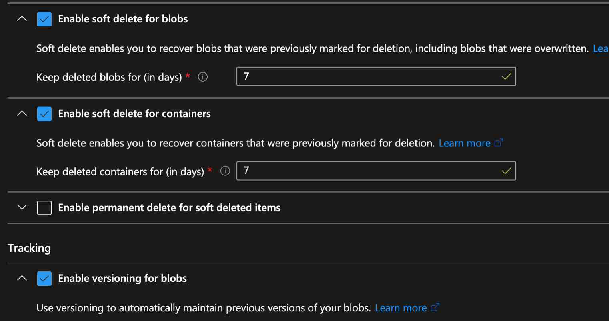
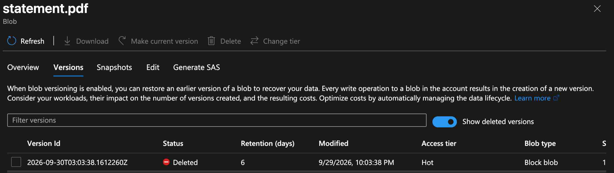
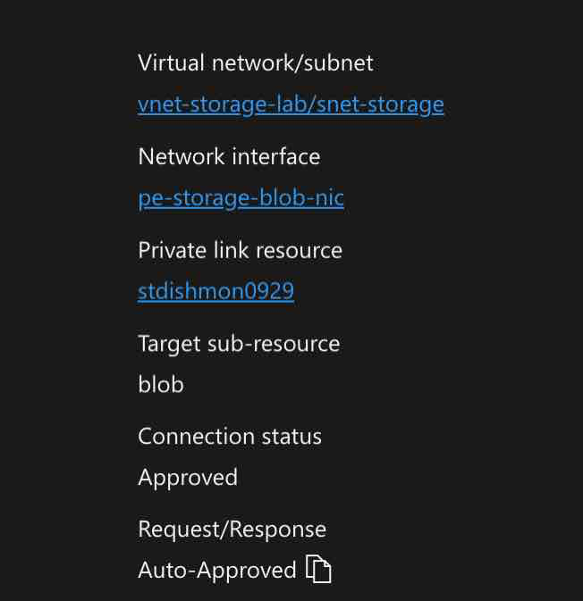
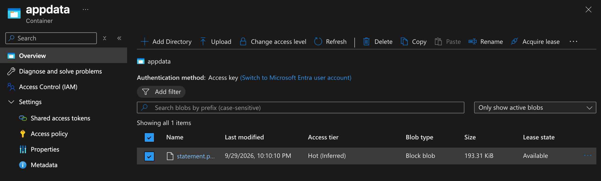

# Reconstructed Lab – Azure Storage Security & Data Protection

## Overview

This reconstructed lab documents hands-on Azure Storage administration in the fictional **Dishmon Technologies** environment.

The lab focused on designing a storage account for resilience, selecting an appropriate access tier, protecting blob data from accidental deletion or overwrite, reviewing encryption choices, generating Shared Access Signatures (SAS), restricting network access, using a private endpoint, and verifying Microsoft Entra-based access.

The goal was to combine storage availability, security, authorization, networking, and data-protection controls into one practical Azure Administrator workflow.

---

## Objectives

- Create and configure an Azure Storage account
- Select an appropriate redundancy option
- Review Hot, Cool, Cold, and Archive access tiers
- Configure blob and container data protection
- Enable blob versioning
- Recover protected blob data
- Compare Microsoft-managed keys and customer-managed keys
- Review customer-managed key requirements and operational tradeoffs
- Generate and test a Shared Access Signature
- Review stored access policy concepts
- Configure a private endpoint for Blob Storage
- Restrict public network access
- Verify Microsoft Entra authorization
- Distinguish management-plane and data-plane access
- Clean up temporary lab resources after verification

---

## Azure Storage Components Reviewed

| Component | Purpose |
|---|---|
| Storage account | Top-level Azure resource for storage services |
| Blob Storage | Stores unstructured object data |
| Azure Files | Provides managed SMB/NFS file shares |
| Queue Storage | Stores messages for asynchronous processing |
| Table Storage | Stores schemaless key/attribute data |
| Access tiers | Optimize storage cost based on access frequency |
| Redundancy | Protects storage data against hardware, zone, or regional failures |
| Soft delete | Protects deleted blobs/containers for a retention period |
| Blob versioning | Preserves previous versions when blob data changes |
| SAS | Delegates limited storage access without sharing an account key |
| Private endpoint | Provides a private IP path from a VNet to a storage subresource |
| Microsoft Entra authorization | Uses identity-based RBAC for storage data access |

---

## 1. Storage Redundancy

The storage account was configured for **Zone-Redundant Storage (ZRS)**.

The business requirement was to remain available if a single availability zone failed without requiring protection from an entire regional outage.

Conceptually:

```text
LRS
    |
    +--> Replicas inside one datacenter / zone scope

ZRS
    |
    +--> Replicas across availability zones in one region

GRS / GZRS
    |
    +--> Adds protection to a secondary Azure region
```

For this scenario, ZRS matched the requirement because the organization needed **zone-level resiliency**, not cross-region disaster recovery.

---

## 2. Storage Access Tier

The default blob access tier selected for the lab was **Hot**.

Hot storage is appropriate for data that:

- Is accessed frequently
- Needs immediate retrieval
- Should not incur the higher access charges associated with colder tiers

### Access Tier Comparison

| Tier | Typical use |
|---|---|
| Hot | Frequently accessed data |
| Cool | Infrequently accessed data that still requires immediate retrieval |
| Cold | Rarely accessed online data |
| Archive | Long-term offline data with retrieval delay |

An important distinction reinforced in the lab is that **Cool and Cold are still online tiers**, while **Archive requires rehydration before normal access**.

---

## 3. Data Protection Configuration

Blob and container protection settings were enabled to reduce the impact of accidental deletion or overwrite.

The configured protections included:

- Blob soft delete
- Container soft delete
- Blob versioning

The screenshot below shows soft delete configured for both blobs and containers with a seven-day retention period, along with blob versioning enabled.



### Soft Delete vs. Blob Versioning

These controls protect against different problems:

```text
Accidental deletion
        |
        v
Soft delete

Accidental overwrite / change
        |
        v
Blob versioning
```

Using both provides stronger protection than relying on either feature alone.

---

## 4. Blob Version Recovery

A blob named:

```text
statement.pdf
```

was used to verify data-protection behavior.

The Versions view showed a previous/deleted version of the blob retained by the account.



This demonstrated that versioning preserves earlier blob states after write operations and can support recovery from accidental overwrite or deletion scenarios.

### Why This Matters

Without versioning, replacing a blob can destroy the previous contents.

With versioning enabled:

```text
Original blob
    |
    +--> Version 1
            |
            +--> Blob modified
                    |
                    +--> Version 2
```

Previous versions remain available according to the account's data-protection configuration.

---

## 5. Storage Encryption

Azure Storage encrypts data at rest by default.

The lab reviewed:

```text
Microsoft-managed keys
vs.
Customer-managed keys
```

### Microsoft-Managed Keys

Microsoft manages the encryption keys and rotation process.

This reduces administrative overhead.

### Customer-Managed Keys

Customer-managed keys provide additional control because the organization manages the encryption key lifecycle, typically through Azure Key Vault or Managed HSM.

The lab scenario favored customer-managed keys when the organization needed to:

- Control key rotation
- Revoke the encryption key independently
- Separate storage administration from key administration

This additional control also introduces operational responsibility because storage access can be affected if the key becomes unavailable.

---

## 6. Shared Access Signatures

A **Shared Access Signature (SAS)** was generated to provide delegated storage access.

SAS is useful when access must be granted without distributing a storage account key.

A SAS can restrict access by factors such as:

- Allowed operations
- Start and expiry time
- Storage service/resource
- Protocol
- IP range

### SAS vs. Access Keys

```text
Storage account key
        |
        +--> Broad control over the storage account

SAS
        |
        +--> Delegated and time-limited access
```

For least privilege, SAS is preferable when an application or user only needs limited access for a defined period.

The lab also reviewed **stored access policies**, which can provide centralized control over service SAS permissions and expiry behavior for supported storage services.

---

## 7. Private Endpoint for Blob Storage

A private endpoint was created for the storage account's Blob service.

The private endpoint configuration showed:

```text
Target sub-resource: blob
Connection status: Approved
```



The endpoint was associated with the storage VNet/subnet used in the lab.

### Why Private Endpoints Matter

A private endpoint maps the storage service into a virtual network using a private IP address.

Conceptually:

```text
VM / workload in VNet
        |
        v
Private endpoint
        |
        v
Azure Storage Blob service
```

This allows storage traffic to remain on private Azure networking paths instead of relying on the public storage endpoint.

---

## 8. Public vs. Private Networking

The lab also verified storage network restrictions.

The important distinction is:

```text
Public endpoint
    |
    +--> Storage service reachable through its public network interface
          subject to firewall / network rules

Private endpoint
    |
    +--> Storage service reachable privately from the connected VNet
```

A private endpoint does not automatically mean that the public endpoint is disabled.

Network configuration must still be reviewed to ensure the public path is restricted according to the organization's requirements.

---

## 9. Microsoft Entra Authorization

Storage access was tested using **Microsoft Entra identity-based authorization**.

Azure Storage supports both management-plane permissions and storage data-plane permissions.

### Management Plane

Controls the Azure resource itself.

Examples:

- View the storage account
- Change networking settings
- Configure diagnostic settings
- Manage resource properties

### Data Plane

Controls the data inside the storage service.

Examples:

- Read blobs
- Upload blobs
- Delete blobs
- List container contents

Data-plane access requires appropriate Storage data roles, such as:

```text
Storage Blob Data Reader
Storage Blob Data Contributor
Storage Blob Data Owner
```

The lab verified Microsoft Entra-based access after the required storage authorization was configured.

---

## 10. Verify Blob Container Access

The final storage access verification showed the `appdata` container and the blob stored inside it.



This confirmed that the storage configuration was functional after the networking and authorization controls were applied.

The portal view showed the authentication method available for the container, reinforcing the distinction between access-key authentication and Microsoft Entra user authentication.

---

## Storage Security Design Summary

The lab combined multiple controls instead of relying on a single security setting:

```text
Availability
    |
    +--> ZRS

Data Protection
    |
    +--> Blob soft delete
    +--> Container soft delete
    +--> Blob versioning

Encryption
    |
    +--> Microsoft-managed or customer-managed keys

Delegated Access
    |
    +--> SAS

Identity Authorization
    |
    +--> Microsoft Entra RBAC

Network Security
    |
    +--> Storage network restrictions
    +--> Private endpoint
```

This layered approach is closer to real Azure administration than treating storage security as one configuration switch.

---

## Key Lessons Learned

- ZRS protects against an availability-zone failure within one Azure region.
- Hot storage is appropriate for frequently accessed data requiring immediate retrieval.
- Cool and Cold tiers remain online, while Archive requires rehydration.
- Soft delete protects against accidental deletion.
- Blob versioning protects against accidental overwrite and preserves previous blob versions.
- Azure Storage encrypts data at rest by default.
- Customer-managed keys provide additional control over key rotation and revocation.
- Additional control with customer-managed keys also adds operational responsibility.
- SAS provides delegated, limited access without sharing a storage account key.
- Stored access policies can centralize control of supported service SAS permissions.
- A private endpoint provides private VNet connectivity to a storage subresource.
- A private endpoint does not automatically disable the public endpoint.
- Storage networking and storage authorization are separate security controls.
- Microsoft Entra authorization requires appropriate storage data-plane roles.
- Management-plane permission does not automatically grant blob data access.
- Storage security is strongest when identity, networking, encryption, and data protection are combined.

---

## AZ-104 Concepts Practiced

This lab reinforced Azure Administrator concepts including:

- Azure Storage accounts
- Blob Storage
- Azure Files
- Queue Storage
- Table Storage
- LRS
- ZRS
- GRS / GZRS concepts
- Hot tier
- Cool tier
- Cold tier
- Archive tier
- Blob soft delete
- Container soft delete
- Blob versioning
- Blob recovery
- Storage encryption
- Microsoft-managed keys
- Customer-managed keys
- Azure Key Vault integration concepts
- Storage account keys
- Shared Access Signatures
- Stored access policies
- Microsoft Entra storage authorization
- Storage data-plane RBAC
- Public network access
- Storage firewall rules
- Private endpoints
- Private Link
- Blob subresources
- Storage security troubleshooting

---

## Verification Results

The following objectives were successfully verified:

- Storage account created
- ZRS selected for zone-level resiliency
- Hot access tier selected
- Blob soft delete enabled
- Container soft delete enabled
- Blob versioning enabled
- Previous blob version identified and recovered
- Encryption options reviewed
- Customer-managed key use case understood
- SAS generated successfully
- Private endpoint created for Blob Storage
- Private endpoint connection reached Approved status
- Storage network restriction behavior verified
- Microsoft Entra-based access verified
- Blob container access verified
- Temporary lab resources cleaned up after verification

---

## Portfolio Evidence

1. **Data Protection – Soft Delete and Versioning**  
   Demonstrates blob/container soft delete and blob versioning configuration.

2. **Blob Version Recovery**  
   Demonstrates a retained previous/deleted version of `statement.pdf`.

3. **Private Endpoint Approved**  
   Demonstrates approved private connectivity to the Blob service through the lab VNet/subnet.

4. **Blob Container Access Verified**  
   Demonstrates successful access to the `appdata` container after the storage security configuration was completed.

---

## Repository Structure

```text
04-Azure-Storage/
└── reconstructed-security-data-protection/
    ├── README.md
    └── screenshots/
        ├── 01-data-protection-soft-delete-versioning.png
        ├── 02-blob-version-recovery.png
        ├── 03-private-endpoint-approved.png
        └── 04-blob-container-access-verified.png
```
