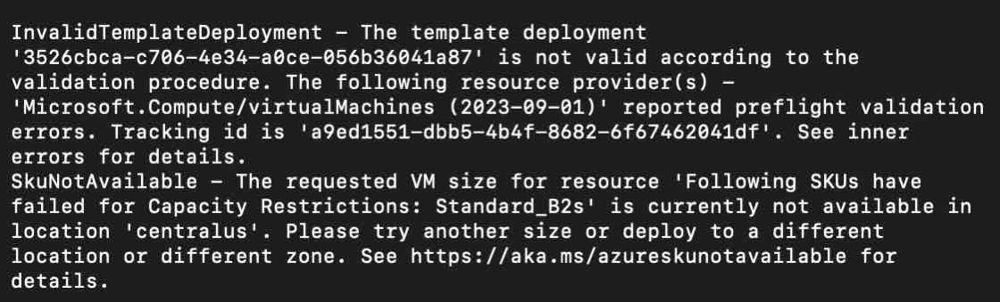
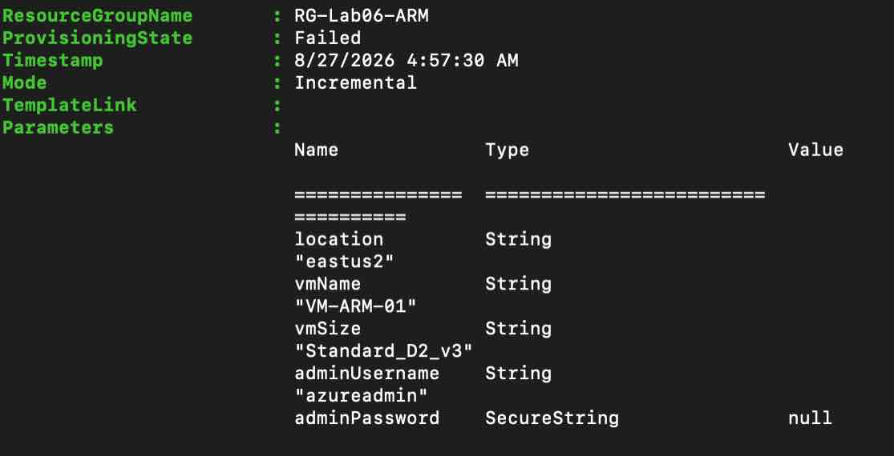
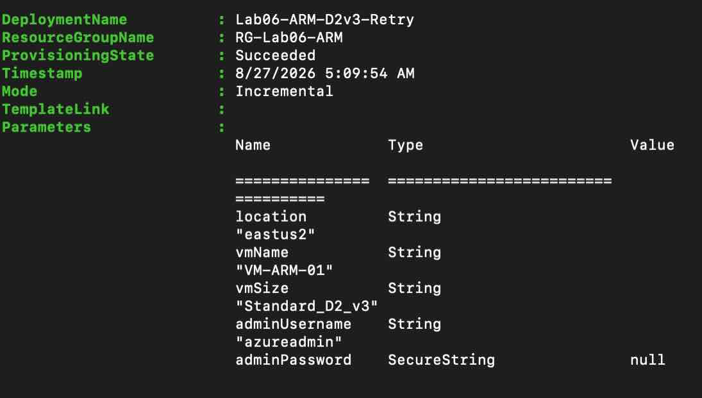
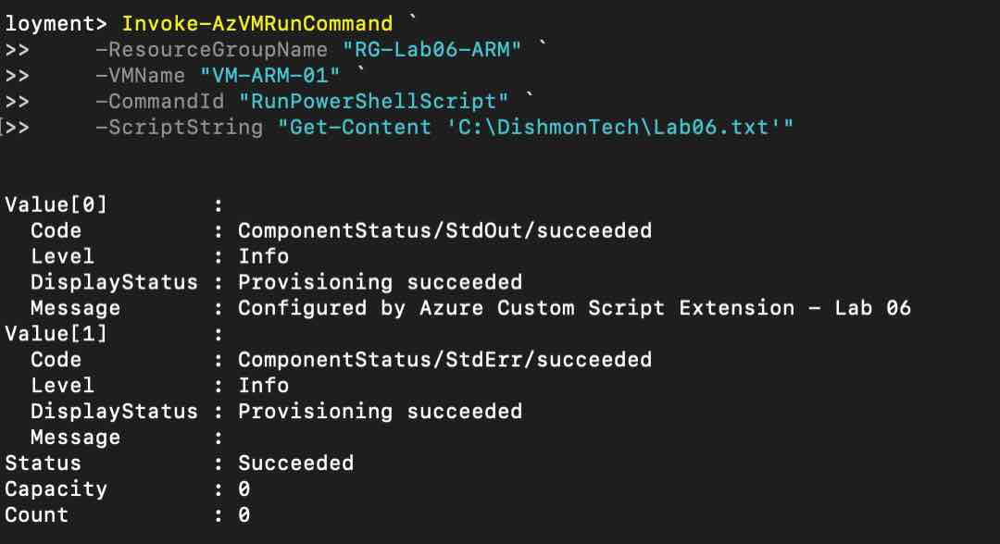

# Lab 06 – ARM Template Deployment & VM Automation

## Overview

This lab demonstrates repeatable Azure infrastructure deployment with an ARM template, Azure PowerShell, Template Specs, and the Custom Script Extension.

The environment was built as an isolated Dishmon Technologies lab so that failed deployments, redeployments, and cleanup could be performed without affecting existing resources.

## Objectives

- Build and validate a parameterized ARM template.
- Deploy a Windows VM and supporting network resources.
- Use `dependsOn` to control resource deployment order.
- Troubleshoot VM SKU capacity, quota, and Hypervisor Generation compatibility.
- Redeploy successfully using Incremental mode.
- Automate guest OS configuration with the Custom Script Extension.
- Publish the working template as a Template Spec.
- Deploy the Template Spec by version.
- Export the current resource-group state as an ARM template.
- Review VHD-based VM deployment concepts.

## Environment

| Item | Configuration |
|---|---|
| Resource group | `RG-Lab06-ARM` |
| Final deployment region | `East US 2` |
| VM | `VM-ARM-01` |
| VM size | `Standard_D2_v3` |
| VNet | `VNET-Lab06` |
| Subnet | `SNET-Servers` |
| NSG | `NSG-VM-ARM-01` |
| Public IP | `PIP-VM-ARM-01` |
| NIC | `NIC-VM-ARM-01` |
| Template Spec | `TS-Dishmon-WindowsVM` |
| Template Spec version | `1.0` |

## ARM Template Design

The ARM template uses parameters for values that may change between deployments, including:

- `location`
- `vmName`
- `vmSize`
- `adminUsername`
- `adminPassword`

The administrator password is defined as a `secureString` and is supplied securely at deployment time rather than stored in the repository.

Variables are used for internal resource names such as the VNet, subnet, NSG, Public IP, and NIC.

The dependency chain is:

```text
VNet / Public IP / NSG
          |
          v
         NIC
          |
          v
          VM
          |
          v
Custom Script Extension
```

The VM depends on the NIC, and the Custom Script Extension depends on the VM.

## Deployment and Validation

The template was validated in multiple layers:

1. Local JSON validation with `ConvertFrom-Json`.
2. Azure Resource Manager preflight validation with `Test-AzResourceGroupDeployment`.
3. Actual deployment with `New-AzResourceGroupDeployment`.

The final successful deployment used Incremental mode.

## Troubleshooting

### SKU capacity restrictions

Several small B-series VM sizes returned `SkuNotAvailable` due to regional capacity restrictions. Regional quota was checked with Azure PowerShell, and multiple regions were tested.

This demonstrated that a VM SKU can be valid and permitted by quota but still be unavailable because of real-time Azure capacity.



### Partial resources after a failed deployment

A deployment can create some resources successfully before a later resource fails. The networking resources remained after the VM deployment failed.

This demonstrated that `dependsOn` controls deployment order but does not provide automatic rollback of already-created resources.



### Hypervisor Generation compatibility

`Standard_D2_v3` passed preflight validation, but deployment failed because the template used the Generation 2 image SKU `2022-datacenter-g2`.

The image was changed to `2022-datacenter`, making it compatible with the selected VM size.

This reinforced the need to match VM size capabilities with image Hypervisor Generation.

## Successful ARM Deployment

After correcting the image compatibility issue, the template was redeployed successfully in Incremental mode.



## Custom Script Extension

The template was extended with `Microsoft.Compute/virtualMachines/extensions`.

The Custom Script Extension created:

```text
C:\DishmonTech\Lab06.txt
```

with the following content:

```text
Configured by Azure Custom Script Extension - Lab 06
```

The result was verified with `Invoke-AzVMRunCommand`.



## Template Specs

The working ARM template was published as:

```text
TS-Dishmon-WindowsVM
```

Version:

```text
1.0
```

The Template Spec was then deployed by referencing the specific version resource ID with `New-AzResourceGroupDeployment`.


## Point-in-Time ARM Export

`Export-AzResourceGroup` was used to capture the current state of the resource group as an ARM template.

The exported template was useful as a point-in-time representation of the deployed environment, but the hand-designed `azuredeploy.json` remained the preferred reusable Infrastructure as Code artifact because it was cleaner and intentionally parameterized.

## VHD Deployment Concept

A Marketplace image creates a fresh OS disk during deployment.

A VHD-based deployment starts from an existing virtual hard disk, which can already contain the operating system, installed software, updates, and configuration. The VHD can be used to create a managed disk and then a VM.

## Scripts

### `Deploy-Lab06.ps1`

Runs ARM preflight validation and performs the Incremental deployment while prompting securely for the VM administrator password.

### `Get-VMQuotaStatus.ps1`

Displays regional VM-family vCPU quota, current usage, and available quota.

### `Deploy-Lab06-ARM-WithFallback.ps1`

Tests candidate Azure regions and attempts deployment immediately after a successful preflight validation. This script was created while troubleshooting dynamic B-series capacity restrictions.

## Key AZ-104 Takeaways

- ARM templates are declarative.
- Parameters make templates reusable between deployments.
- Variables hold internal reusable values.
- `dependsOn` controls deployment order.
- Incremental deployments reconcile desired state without automatically removing unrelated resources.
- Successful preflight validation does not reserve VM capacity.
- `SkuNotAvailable` indicates a SKU/capacity problem.
- `QuotaExceeded` indicates a subscription quota problem.
- VM size and image Hypervisor Generation must be compatible.
- Template Specs provide versioned, centrally stored ARM templates that can be controlled with Azure RBAC.
- `secureString` parameters should be supplied securely and never committed as plaintext secrets.
- Custom Script Extension can automate configuration inside a VM after provisioning.
- Exported ARM templates represent current state and may be more verbose than intentionally designed reusable templates.

## Cleanup

The VM was deallocated immediately after VM-specific verification to stop compute charges.

After all verification and screenshots were complete, the temporary resource group `RG-Lab06-ARM` and all resources inside it were deleted.
