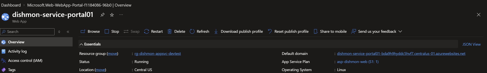
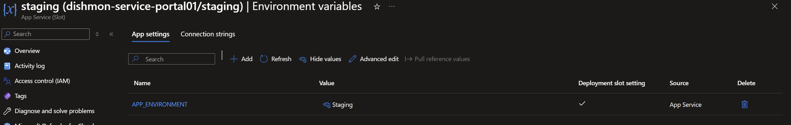
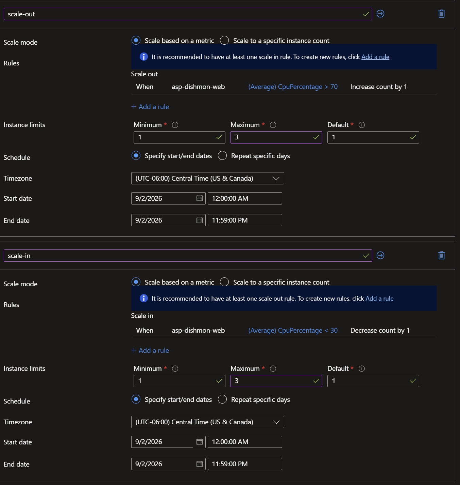
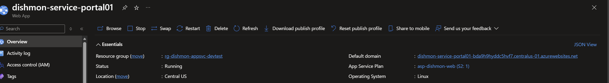

# Lab 08 – Azure App Service

## Overview

This lab focused on deploying and administering an Azure App Service workload for the fictional **Dishmon Technologies** environment.

The lab demonstrated how Azure App Service separates the web application from the underlying **App Service Plan**, how deployment slots can maintain environment-specific configuration, and how an administrator can scale an application both vertically and horizontally.

The Web App was also verified through its Azure-provided default domain, and a service availability issue was troubleshot by restarting the application.

---

## Objectives

- Create and manage an Azure Web App
- Understand the relationship between a Web App and an App Service Plan
- Configure an App Service deployment slot
- Configure a deployment slot-specific application setting
- Perform manual horizontal scaling
- Configure metric-based autoscaling
- Define minimum, maximum, and default instance counts
- Scale an App Service Plan vertically
- Verify Web App availability
- Troubleshoot an unresponsive Web App
- Clean up temporary Azure resources

---

## Azure Resources

| Resource | Configuration |
|---|---|
| Web App | `dishmon-service-portal01` |
| App Service Plan | `asp-dishmon-web` |
| Resource Group | `rg-dishmon-appsvc-devtest` |
| Operating System | Linux |
| Region | Central US |
| Initial Pricing Tier | S1 |
| Scaled Pricing Tier | S2 |
| Deployment Slot | `staging` |

---

## Web App Deployment

An Azure Web App named:

```text
dishmon-service-portal01
```

was deployed using a Linux-based App Service Plan in the **Central US** region.

The Web App ran on the App Service Plan:

```text
asp-dishmon-web
```

The initial plan tier used for the lab was **Standard S1**.



This reinforced an important App Service concept:

> The Web App contains the application configuration, while the App Service Plan provides the compute resources used to run the application.

Multiple Web Apps can share the same App Service Plan.

---

## Deployment Slot Configuration

A deployment slot named:

```text
staging
```

was configured for the Web App.

The staging slot included the following application setting:

```text
APP_ENVIRONMENT = Staging
```

The value was configured as a **Deployment slot setting**.



A deployment slot setting remains associated with its slot rather than automatically moving during a slot swap.

This is useful for environment-specific configuration such as:

- environment names
- API endpoints
- connection configuration
- application behavior that differs between staging and production

---

## Horizontal Scaling

Horizontal scaling changes the **number of App Service instances** running the workload.

The App Service Plan was configured with automatic scaling based on CPU utilization.

### Scale Out Rule

When average CPU utilization exceeded:

```text
70%
```

Azure was configured to:

```text
Increase instance count by 1
```

### Scale In Rule

When average CPU utilization dropped below:

```text
30%
```

Azure was configured to:

```text
Decrease instance count by 1
```

The autoscale profile used:

```text
Minimum instances: 1
Maximum instances: 3
Default instances: 1
```



This allows Azure to increase available compute capacity during periods of higher demand and reduce capacity when demand decreases.

Manual scaling was also tested to verify that the App Service Plan instance count could be changed directly.

---

## Vertical Scaling

Vertical scaling changes the amount of compute available to each App Service instance.

The App Service Plan was initially running on:

```text
Standard S1
```

The plan was then scaled up to:

```text
Standard S2
```



This demonstrated the difference between the two primary scaling approaches:

| Scaling Method | What Changes |
|---|---|
| Scale Up / Down | Pricing tier and compute resources per instance |
| Scale Out / In | Number of running instances |

A key administrative lesson from the lab was that scaling is performed at the **App Service Plan level**.

Therefore, Web Apps sharing the same App Service Plan share the underlying compute capacity.

---

## Web App Verification

The Web App was tested through its Azure-provided default domain.

The application successfully returned the Azure App Service default page:

```text
Your web app is running and waiting for your content
```


The default page confirmed that:

- the Web App was running
- the App Service endpoint was reachable
- Azure was successfully serving HTTP content

No custom Node.js application was deployed during this verification. The page shown is the default Azure App Service placeholder.

---

## Troubleshooting

### Web App Remained on a Loading Screen

After scaling operations, opening the Web App's default domain resulted in a page that remained stuck loading.

The application configuration and Web App status were reviewed.

The Web App was then restarted from Azure App Service.

After the restart, the default domain successfully returned the Azure App Service page.

This demonstrated an important troubleshooting distinction:

> A resource showing a `Running` state does not always guarantee that the application endpoint is responding correctly.

Administrators should verify the workload from the client perspective rather than relying only on Azure resource status.

---

## App Service Plan vs. Web App

One of the most important concepts reinforced during this lab was the relationship between a Web App and its App Service Plan.

```text
App Service Plan
      |
      |-- Compute resources
      |-- Pricing tier
      |-- Instance count
      |-- Scaling configuration
      |
      +---- Web App
      +---- Web App
      +---- Web App
```

The **App Service Plan** controls the compute infrastructure.

The **Web App** contains the application and its application-specific configuration.

Because multiple applications can share a plan, scaling the plan can affect the capacity available to all applications hosted on that plan.

---

## Verification Results

The following administrative tasks were successfully verified:

- Web App running in Azure App Service
- Linux App Service configuration
- Staging deployment slot
- Slot-specific environment setting
- Manual horizontal scaling
- CPU-based automatic scale out
- CPU-based automatic scale in
- Minimum and maximum instance limits
- Vertical scaling from S1 to S2
- Web App availability through the default domain
- Successful recovery after restarting the Web App

---

## Key Lessons Learned

- Azure Web Apps run on compute resources provided by an App Service Plan.
- Multiple Web Apps can share one App Service Plan.
- Scaling settings apply to the App Service Plan rather than an individual Web App.
- Scale up/down changes the compute resources available to each instance.
- Scale out/in changes the number of instances.
- Autoscale can respond automatically to metrics such as CPU utilization.
- Minimum and maximum instance limits prevent uncontrolled scaling.
- Deployment slots allow administrators to maintain separate application environments.
- Deployment slot settings can remain associated with a specific slot.
- Azure resource status should be combined with functional endpoint verification.
- Restarting an App Service can be an appropriate troubleshooting step when an application is running but not responding correctly.

---

## AZ-104 Concepts Practiced

This lab reinforced Azure Administrator concepts including:

- Azure App Service
- Web Apps
- App Service Plans
- Deployment slots
- Application settings
- Deployment slot settings
- Vertical scaling
- Horizontal scaling
- Manual scaling
- Autoscale
- Metric-based scaling
- CPU utilization
- Instance limits
- App Service troubleshooting
- Application availability verification
- Azure resource cleanup

---

## Portfolio Evidence

The following screenshots provide evidence of the completed configuration:

1. **Web App Overview – S1**  
   Demonstrates the running Linux Web App and its original Standard S1 App Service Plan.

2. **Scale Up – S2**  
   Demonstrates vertical scaling of the App Service Plan from S1 to S2.

3. **Staging Slot Configuration**  
   Demonstrates a staging deployment slot with a slot-specific `APP_ENVIRONMENT` setting.

4. **Autoscale Configuration**  
   Demonstrates CPU-based scale-out and scale-in rules with defined instance limits.

5. **Successful Web App Response**  
   Demonstrates successful HTTP availability through the Azure-provided Web App endpoint.

---

## Cleanup

The temporary Azure resources created for this lab were removed after verification was complete.

This prevented unnecessary Azure consumption while preserving the configuration and verification evidence in this repository.

---

## Repository Structure

```text
Lab-08-Azure-App-Service/
├── README.md
└── screenshots/
    ├── 01-web-app-overview-s1.png
    ├── 02-scale-up-s2.png
    ├── 03-staging-slot-configuration.png
    ├── 04-autoscale-cpu-rules.png
    └── 05-web-app-successful-response.png
```
