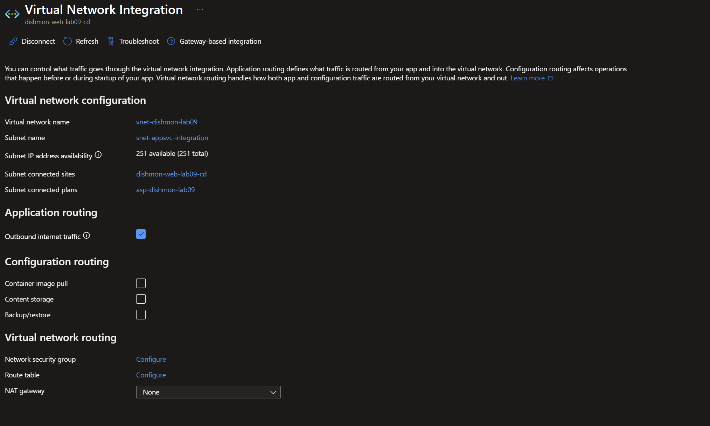
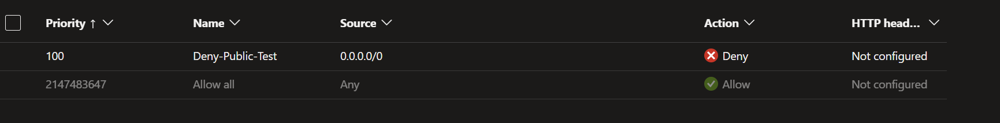
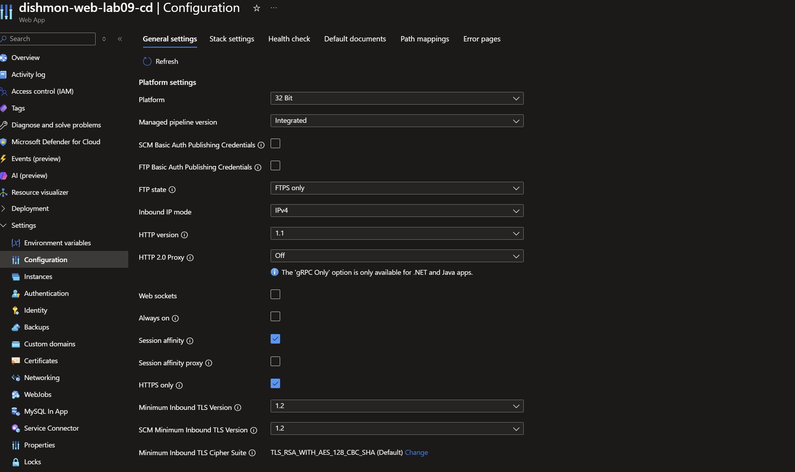
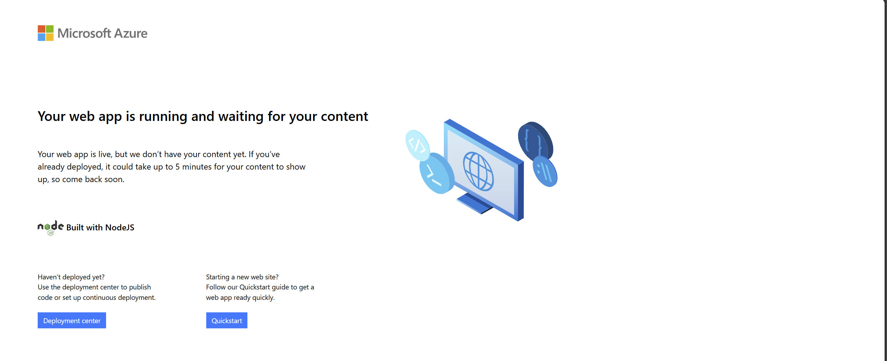

# Lab 09 – App Service Networking, Access Restrictions & TLS

## Overview

This lab focused on securing and integrating an Azure App Service workload for the fictional **Dishmon Technologies** environment.

The lab demonstrated how **Virtual Network Integration** allows an App Service to send outbound traffic into an Azure virtual network, while **App Service access restrictions** control inbound access to the web app.

The lab also verified HTTPS enforcement, minimum TLS settings, expected 403 behavior when public access was denied, and successful recovery after public access was restored.

---

## Objectives

- Integrate an Azure Web App with a virtual network
- Create a dedicated VNet and subnet for App Service integration
- Understand the purpose of App Service VNet Integration
- Distinguish outbound VNet Integration from inbound access control
- Configure an App Service access restriction
- Deny public access and verify the expected HTTP 403 response
- Restore public access and verify the Web App responds again
- Enforce HTTPS
- Review and verify minimum inbound TLS settings
- Reinforce custom-domain and TLS concepts relevant to App Service
- Clean up temporary Azure resources

---

## Azure Resources

| Resource | Configuration |
|---|---|
| Web App | `dishmon-web-lab09-cd` |
| App Service Plan | `asp-dishmon-lab09` |
| Virtual Network | `vnet-dishmon-lab09` |
| Integration Subnet | `snet-appsvc-integration` |
| HTTPS Only | Enabled |
| Minimum Inbound TLS | 1.2 |
| SCM Minimum Inbound TLS | 1.2 |

---

## Virtual Network Integration

The Web App was integrated with:

```text
vnet-dishmon-lab09
```

through the subnet:

```text
snet-appsvc-integration
```



The integration connected the App Service to the virtual network for **outbound traffic**.

A key concept reinforced in this lab was:

> App Service VNet Integration does not make the Web App private for inbound users.

VNet Integration is primarily used when the application needs to reach resources through the virtual network.

Examples include:

- databases
- private endpoints
- internal APIs
- virtual machines
- other network-restricted services

---

## Inbound Access Restrictions

To test inbound access control, an App Service access restriction named:

```text
Deny-Public-Test
```

was configured.

The rule used:

```text
Source: 0.0.0.0/0
Action: Deny
Priority: 100
```



Because the deny rule had a higher priority than the default allow rule, requests from the public internet were blocked.

---

## 403 Verification

After the deny rule was applied, the Web App was tested from the public internet.

Azure returned:

```text
Error 403 - Forbidden
```


This was the expected result.

The test demonstrated an important administrative workflow:

```text
Configure restriction
        ↓
Test application
        ↓
Observe expected failure
        ↓
Confirm security rule is working
```

A 403 response in this scenario was not an application failure. It was evidence that the App Service access restriction was successfully enforcing the intended inbound policy.

---

## VNet Integration vs. Inbound Access Control

This lab reinforced the difference between two App Service networking features that can easily be confused.

| Feature | Primary Purpose |
|---|---|
| VNet Integration | Allows the Web App to send outbound traffic into a VNet |
| Access Restrictions | Controls which inbound clients can reach the Web App |

The relationship can be summarized as:

```text
Web App
   |
   |---- Outbound ----> VNet Integration ----> VNet resources
   |
   <---- Inbound ----- Access Restrictions <---- Clients
```

This distinction is important for both real Azure administration and AZ-104 scenario questions.

---

## HTTPS and TLS Configuration

The Web App was configured with:

```text
HTTPS Only: Enabled
Minimum Inbound TLS Version: 1.2
SCM Minimum Inbound TLS Version: 1.2
```



Enabling **HTTPS Only** ensures HTTP requests are redirected to HTTPS.

The minimum TLS setting controls the oldest TLS protocol version clients are allowed to use when establishing encrypted connections to the application.

The SCM TLS setting applies to the App Service management/deployment endpoint.

---

## Custom Domain and Certificate Concepts

The lab also reinforced the relationship between custom domains, DNS, certificates, and TLS in Azure App Service.

A custom domain generally requires:

1. Ownership of a DNS domain
2. A DNS record that points the custom hostname to the App Service
3. Domain validation in Azure App Service
4. A certificate that covers the hostname
5. A TLS/SSL binding between the certificate and the custom hostname

No public custom domain was required to complete the networking verification documented in this repository.

The hands-on evidence for this lab focuses on:

- VNet Integration
- inbound access restrictions
- HTTPS enforcement
- TLS configuration
- functional access verification

---

## Public Access Restoration

After the access restriction test was complete, public access was restored.

The Web App was tested again and successfully returned the Azure App Service default page.



This completed the verification sequence:

```text
Public access available
        ↓
Deny rule applied
        ↓
403 Forbidden
        ↓
Public access restored
        ↓
Web App responds successfully
```

---

## Troubleshooting and Verification

The lab intentionally created a connectivity failure to verify the access-control configuration.

### Expected Failure

When the `Deny-Public-Test` rule blocked:

```text
0.0.0.0/0
```

the public Web App endpoint returned:

```text
403 Forbidden
```

The response confirmed that the inbound restriction was working.

### Recovery

The public access configuration was restored after testing.

The Web App was then reachable again.

This reinforced an important troubleshooting principle:

> Test both the blocked state and the restored state so that security configuration and recovery are both verified.

---

## Verification Results

The following tasks were successfully verified:

- Dedicated App Service VNet Integration
- Web App connected to `vnet-dishmon-lab09`
- Integration through `snet-appsvc-integration`
- Public inbound access restriction
- Deny rule for `0.0.0.0/0`
- HTTP 403 response while public access was blocked
- HTTPS Only enabled
- Minimum inbound TLS version set to 1.2
- SCM minimum inbound TLS version set to 1.2
- Public access restored after testing
- Web App responded successfully after recovery

---

## Key Lessons Learned

- App Service VNet Integration is primarily for outbound connectivity from the Web App into a virtual network.
- VNet Integration by itself does not make the Web App private for inbound access.
- App Service access restrictions can allow or deny inbound traffic.
- Access restriction priority determines which rule is evaluated first.
- A 403 response can be expected behavior when an App Service access restriction blocks a request.
- Verification should include both the restricted state and the restored state.
- HTTPS Only enforces encrypted access to the Web App.
- Minimum TLS settings control which TLS protocol versions clients may use.
- Custom domain configuration depends on DNS validation and certificate configuration.
- Networking behavior should be tested from the client perspective rather than assumed from portal configuration alone.

---

## AZ-104 Concepts Practiced

This lab reinforced Azure Administrator concepts including:

- Azure App Service
- App Service networking
- Virtual Network Integration
- Virtual networks
- Subnets
- Outbound application routing
- Inbound access restrictions
- Access restriction priorities
- Public access control
- HTTP 403 troubleshooting
- HTTPS Only
- TLS
- Minimum TLS versions
- SCM endpoint security
- DNS and custom-domain concepts
- App Service certificates
- Functional verification
- Azure resource cleanup

---

## Portfolio Evidence

The following screenshots provide evidence of the completed configuration:

1. **Virtual Network Integration**  
   Demonstrates the Web App connected to `vnet-dishmon-lab09` through `snet-appsvc-integration`.

2. **Public Access Deny Rule**  
   Demonstrates an App Service access restriction denying `0.0.0.0/0`.

3. **403 Access Blocked**  
   Demonstrates that the inbound deny rule successfully blocked public access.

4. **HTTPS and TLS Configuration**  
   Demonstrates HTTPS Only and minimum TLS 1.2 configuration.

5. **Public Access Restored**  
   Demonstrates successful Web App access after the restriction test was completed.

---

## Cleanup

The temporary Azure resources created for this lab were removed after verification was complete.

This prevented unnecessary Azure consumption while preserving the configuration and verification evidence in this repository.

---

## Repository Structure

```text
Lab-09-App-Service-Networking-TLS/
├── README.md
└── screenshots/
    ├── 01-vnet-integration.png
    ├── 02-public-access-deny-rule.png
    ├── 03-403-access-blocked.png
    ├── 04-https-tls-configuration.png
    └── 05-public-access-restored.png
```
