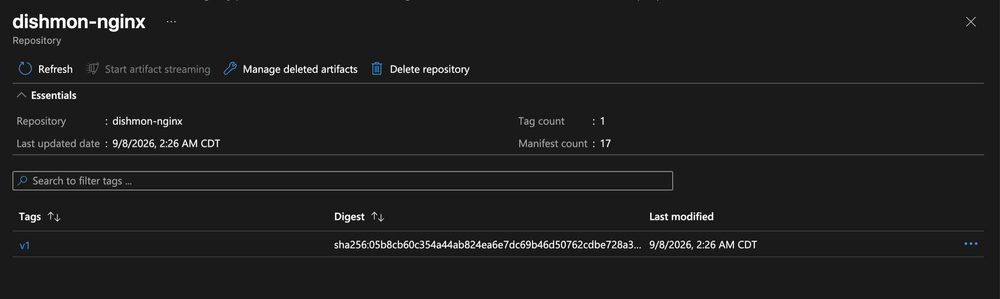
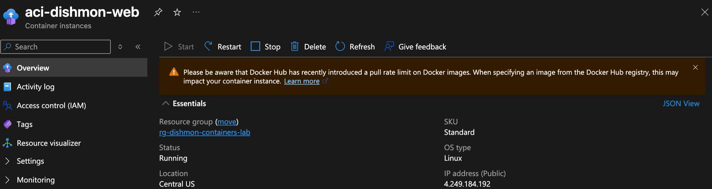
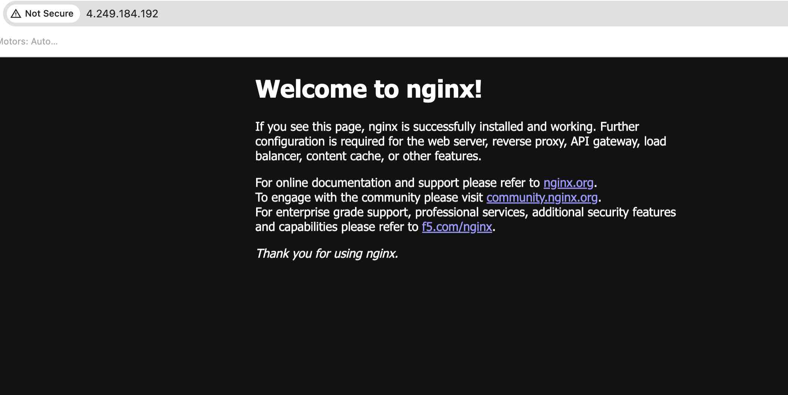
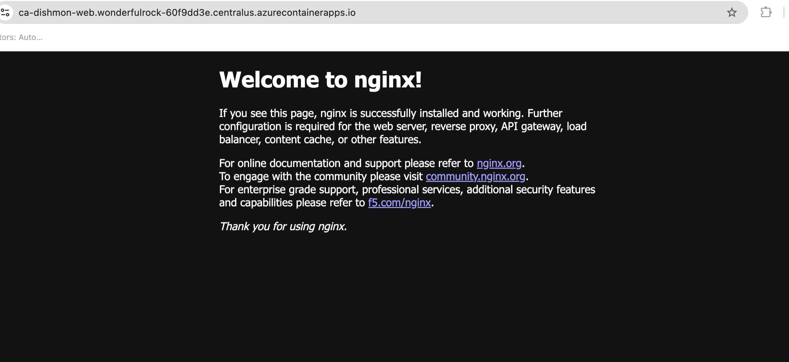
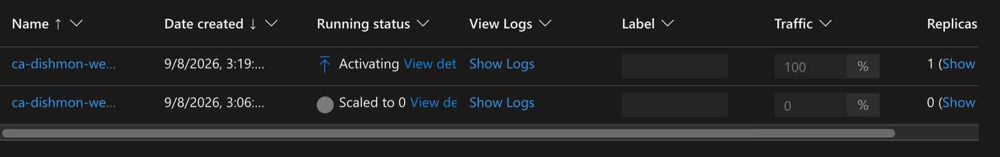

# Lab 10 – Azure Containers: ACR, ACI & Container Apps

## Overview

This lab focused on working with container workloads across three Azure services for the fictional **Dishmon Technologies** environment:

- **Azure Container Registry (ACR)** for private container image storage
- **Azure Container Instances (ACI)** for simple serverless container execution
- **Azure Container Apps** for managed container hosting with revisions and horizontal scaling

The lab demonstrated how a container image can be stored in a private registry, deployed as a running container workload, verified through a public endpoint, and then used in a more advanced managed container platform with revision support and scale-to-zero behavior.

---

## Objectives

- Create and use an Azure Container Registry
- Import and store an nginx container image in ACR
- Understand the role of repositories and tags in ACR
- Deploy a container with Azure Container Instances
- Expose an ACI workload through a public IP address
- Verify the ACI workload from a browser
- Troubleshoot ACI endpoint connectivity
- Deploy the workload to Azure Container Apps
- Verify the Container App through its application URL
- Configure Container Apps scaling behavior
- Understand scale-to-zero
- Work with Container Apps revisions
- Understand how revisions support safer deployments and rollback
- Preserve useful PowerShell scripts for repeatable administration
- Clean up temporary Azure resources

---

## Azure Services Used

| Service | Purpose |
|---|---|
| Azure Container Registry | Private storage for container images |
| Azure Container Instances | Simple container execution without managing servers |
| Azure Container Apps | Managed container hosting with revisions and autoscaling |

---

## Azure Container Registry

A private Azure Container Registry was used to store the container image for the lab.

The repository:

```text
dishmon-nginx
```

contained the image tag:

```text
v1
```



This demonstrated the relationship between an ACR registry, repository, and image tag.

```text
Azure Container Registry
        |
        +-- Repository: dishmon-nginx
                |
                +-- Tag: v1
```

ACR provides a private location for storing container images that can later be pulled by Azure container services.

---

## Azure Container Instances

An Azure Container Instance named:

```text
aci-dishmon-web
```

was deployed as a Linux container in the **Central US** region.



ACI provided a simple way to run the container without provisioning or administering a virtual machine or Kubernetes cluster.

The workload was exposed using a public IP address.

---

## ACI Verification

The running container was tested from a browser.

The nginx default page successfully loaded from the ACI public endpoint.



This provided functional verification that:

- the container was running
- the endpoint was reachable
- nginx was serving HTTP content

A resource showing a `Running` status was not treated as sufficient verification by itself. The workload was tested from the client perspective.

---

## ACI Troubleshooting

The ACI endpoint initially appeared unreachable when the public IP address and FQDN were opened in the browser.

The issue was not the container itself.

The browser request needed to explicitly use:

```text
http://
```

because the container was serving HTTP traffic.

After using the correct protocol, the nginx page loaded successfully.

### Troubleshooting flow

```text
Container status: Running
        ↓
Endpoint appears unreachable
        ↓
Verify URL and protocol
        ↓
Use http://
        ↓
nginx responds successfully
```

This reinforced the importance of checking the application protocol instead of assuming the Azure resource is misconfigured.

---

## Azure Container Apps

The same container workload was also deployed using Azure Container Apps.

The Container App:

```text
ca-dishmon-web
```

was placed in a Container Apps environment and exposed through an application URL.

The public endpoint successfully returned the nginx page.



This demonstrated a more advanced managed container platform than ACI.

---

## ACI vs. Container Apps

The lab reinforced the difference between the two container execution services.

| Feature | Azure Container Instances | Azure Container Apps |
|---|---|---|
| Primary use | Simple container execution | Managed application hosting |
| Server management | None | None |
| Revisions | No | Yes |
| Built-in horizontal autoscaling | No | Yes |
| Scale to zero | No built-in autoscale behavior | Yes |
| Deployment history / rollback | Limited | Revision-based |

ACI is useful when an administrator needs a container to run without maintaining infrastructure.

Container Apps is a better fit when the workload needs application-focused capabilities such as scaling and revision management.

---

## Container Apps Scaling

The Container App was configured with:

```text
Minimum replicas: 0
Maximum replicas: 10
```

A minimum replica count of `0` allows the application to **scale to zero** when there is no demand.

This can reduce unnecessary compute consumption for workloads that do not need to remain continuously active.

When traffic returns, Container Apps can create replicas again based on its scaling configuration.

---

## Container Apps Revisions

Multiple Container Apps revisions were created during the lab.

The newer revision received the application traffic, while the previous revision remained available but inactive.



The revision view demonstrated:

- the newer revision receiving traffic
- an active replica for the current revision
- the previous revision receiving 0% traffic
- the older revision scaled to 0 replicas

Revisions are useful because they preserve deployment history.

If a new revision introduces a problem, an administrator can shift traffic back to an earlier working revision instead of rebuilding the application from scratch.

---

## Revision and Rollback Concept

The deployment model can be summarized as:

```text
Revision v1
   |
   |  previous version
   |  0% traffic
   |  scaled to 0
   |
Revision v2
   |
   |  current version
   |  100% traffic
   |  active replica
```

This provides a safer deployment model than replacing the running application in place without version history.

---

## End-to-End Container Workflow

This lab connected the services into one container administration workflow:

```text
Container image
      ↓
Azure Container Registry
      ↓
dishmon-nginx:v1
      ↓
 ┌───────────────┬────────────────────┐
 ↓               ↓
ACI          Container Apps
 ↓               ↓
HTTP response    HTTPS response
                 ↓
              Revisions
                 ↓
       Scaling and rollback support
```

This demonstrated the difference between image storage, simple container execution, and managed container application hosting.

---

## PowerShell Scripts

The following PowerShell scripts were preserved from the lab:

```text
scripts/
├── 01-import-nginx-v1.ps1
├── 02-create-v2-tag.ps1
└── Lab10-ACR-Scripts.ps1
```

These scripts support repeatable container registry administration and preserve the commands used during the lab.

### Script Purpose

- `01-import-nginx-v1.ps1`  
  Preserves the process used to import or create the initial nginx `v1` image in Azure Container Registry.

- `02-create-v2-tag.ps1`  
  Preserves the process used to create the `v2` image tag used for a later deployment/revision.

- `Lab10-ACR-Scripts.ps1`  
  Preserves the combined ACR-related commands used during Lab 10.

No credentials, passwords, or sensitive registry secrets should be committed to the repository.

---

## Verification Results

The following tasks were successfully verified:

- ACR repository created and populated
- nginx image stored with the `v1` tag
- ACI deployed successfully
- ACI running on Linux
- ACI public endpoint reachable over HTTP
- nginx response verified from ACI
- Container App deployed successfully
- Container App application URL reachable
- nginx response verified from Container Apps
- Container Apps configured with minimum replicas of 0
- Container Apps configured with maximum replicas of 10
- Multiple Container Apps revisions created
- Newer revision receiving application traffic
- Previous revision retained and scaled to zero
- PowerShell scripts preserved for repeatable administration

---

## Key Lessons Learned

- ACR stores private container images; it does not run containers.
- Repositories organize container images inside ACR.
- Tags such as `v1` and `v2` identify image versions.
- ACI is useful for simple serverless container execution.
- ACI does not provide built-in horizontal autoscaling like Container Apps.
- A running Azure resource should still be tested from the client perspective.
- The correct application protocol matters when troubleshooting connectivity.
- Azure Container Apps supports automatic horizontal scaling.
- Container Apps can scale to zero when minimum replicas are set to 0.
- Revisions provide deployment history and make rollback easier.
- ACR, ACI, and Container Apps solve different parts of the container lifecycle.
- Preserving scripts makes repeatable administration easier and provides stronger portfolio evidence.

---

## AZ-104 Concepts Practiced

This lab reinforced Azure Administrator concepts including:

- Azure Container Registry
- Container repositories
- Container image tags
- Private container images
- Azure Container Instances
- Container groups
- Public container endpoints
- Container ports
- Azure Container Apps
- Container Apps environments
- Horizontal scaling
- Minimum and maximum replicas
- Scale-to-zero
- Container Apps revisions
- Traffic assignment
- Rollback concepts
- Container troubleshooting
- PowerShell automation
- Azure resource cleanup

---

## Portfolio Evidence

The following screenshots provide evidence of the completed configuration:

1. **ACR Repository – v1**  
   Demonstrates the `dishmon-nginx` repository and `v1` image tag.

2. **ACI Running**  
   Demonstrates the running Linux Azure Container Instance.

3. **ACI nginx Response**  
   Demonstrates successful HTTP access to the nginx workload running in ACI.

4. **Container App nginx Response**  
   Demonstrates successful access to the same workload through Azure Container Apps.

5. **Container App Revisions**  
   Demonstrates current and previous revisions, traffic assignment, and replica state.

---

## Cleanup

The temporary Azure resources created for this lab were removed after verification was complete.

This prevented unnecessary Azure consumption while preserving documentation, screenshots, and reusable PowerShell scripts in this repository.

---

## Repository Structure

```text
Lab-10-Azure-Containers/
├── README.md
├── scripts/
│   ├── 01-import-nginx-v1.ps1
│   ├── 02-create-v2-tag.ps1
│   └── Lab10-ACR-Scripts.ps1
└── screenshots/
    ├── 01-acr-repository-v1.png
    ├── 02-aci-running.png
    ├── 03-aci-nginx-response.png
    ├── 04-container-app-nginx-response.png
    └── 05-container-app-revisions.jpg
```
