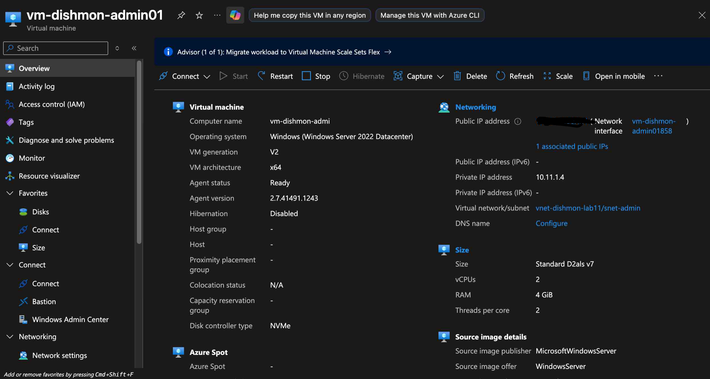
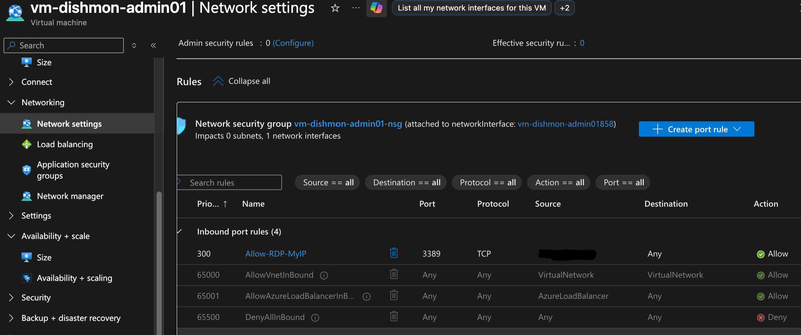
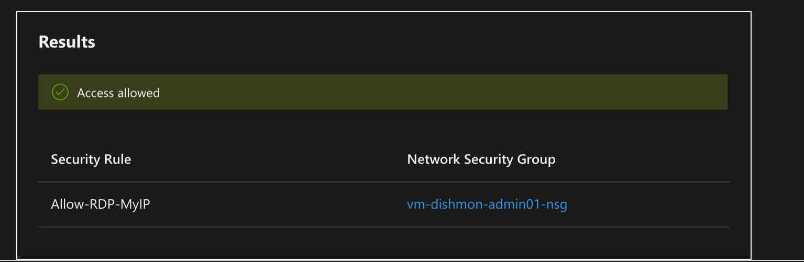
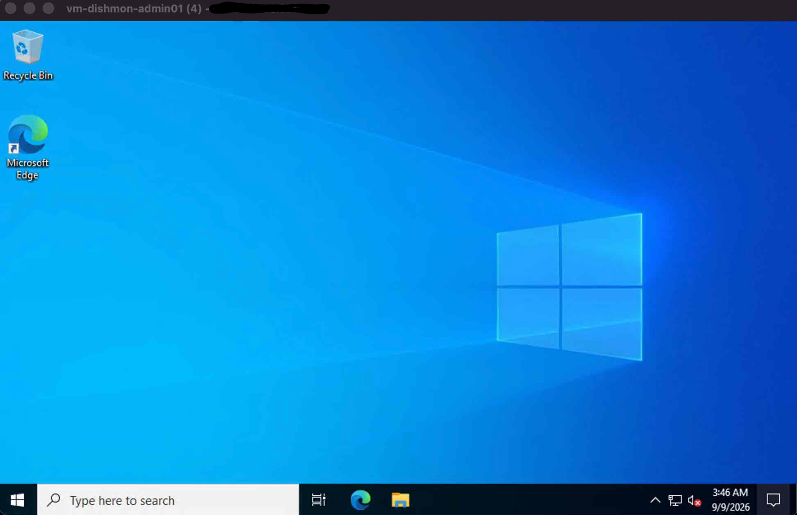

# Lab 11 – Azure VNet, Subnets, Public IP & RDP Access

## Overview

This lab focused on deploying and troubleshooting a Windows virtual machine in the fictional **Dishmon Technologies** Azure environment.

The lab demonstrated how a virtual machine depends on several networking components working together, including a Virtual Network (VNet), subnet, network interface (NIC), private IP address, public IP address, Network Security Group (NSG), and inbound security rules.

The lab also included a real troubleshooting workflow in which RDP initially failed, Azure networking configuration was reviewed, **IP Flow Verify** was used to validate the traffic path, and RDP was successfully restored.

The final RDP rule was then restricted to a specific administrator source IP instead of leaving TCP port 3389 open to the entire internet.

---

## Objectives

- Deploy a Windows virtual machine
- Place the VM in a dedicated virtual network and subnet
- Understand how the VM NIC connects the VM to the VNet
- Review private and public IP addressing
- Understand how NSGs control inbound traffic
- Troubleshoot a failed RDP connection
- Configure an inbound RDP rule for TCP 3389
- Use Azure Network Watcher IP Flow Verify
- Verify successful Remote Desktop connectivity
- Apply least-privilege network access
- Clean up temporary Azure resources

---

## Azure Resources

| Resource | Configuration |
|---|---|
| Virtual Machine | `vm-dishmon-admin01` |
| Operating System | Windows Server 2022 Datacenter |
| Virtual Network | `vnet-dishmon-lab11` |
| Subnet | `snet-admin` |
| Private IP | `10.11.1.4` |
| Network Security Group | `vm-dishmon-admin01-nsg` |
| RDP Port | TCP 3389 |
| RDP Rule | `Allow-RDP-MyIP` |

Public IP values were intentionally redacted from portfolio screenshots.

---

## VM Networking Overview

The virtual machine was connected to:

```text
vnet-dishmon-lab11
```

through the subnet:

```text
snet-admin
```

The VM used a network interface to connect to the virtual network and received the private IP:

```text
10.11.1.4
```

A public IP address was also associated with the VM so it could be reached from outside Azure during the lab.



The relationship can be summarized as:

```text
Internet
   |
Public IP
   |
Network Interface
   |
Private IP
   |
Subnet
   |
Virtual Network
   |
Virtual Machine
```

---

## Initial RDP Failure

After the VM was deployed, an RDP connection was attempted.

The connection failed.

This was expected because the required inbound NSG rule had not yet been correctly configured to allow the administrator's RDP traffic.

Instead of assuming the VM itself was broken, the troubleshooting process focused on the network path.

The following areas were checked:

- VM running state
- NIC association
- public IP assignment
- private IP assignment
- VNet and subnet placement
- RDP availability
- NSG inbound rules
- effective traffic behavior

---

## Network Security Group Configuration

The VM's Network Security Group was configured with an inbound rule named:

```text
Allow-RDP-MyIP
```

The rule allowed:

```text
Protocol: TCP
Destination port: 3389
Source: Administrator public IP
Action: Allow
Priority: 300
```



The source was intentionally restricted to the administrator's public IP rather than:

```text
Any
```

or:

```text
0.0.0.0/0
```

This reduced exposure of the RDP service to the public internet.

---

## Least-Privilege Network Access

The final NSG configuration applied the principle of least privilege.

Instead of allowing anyone on the internet to attempt an RDP connection:

```text
Internet
   |
   |  Any source
   X
```

only the administrator's approved public IP was allowed:

```text
Administrator IP
       |
       | TCP 3389
       v
      NSG
       |
       v
Windows VM
```

This is a stronger administrative configuration than leaving RDP open globally.

---

## IP Flow Verify

Azure Network Watcher **IP Flow Verify** was used to validate whether the RDP traffic would be allowed or denied.

The result showed:

```text
Access allowed
```

and identified:

```text
Allow-RDP-MyIP
```

as the security rule permitting the traffic.



This provided a more precise troubleshooting signal than repeatedly attempting RDP without checking the Azure network configuration.

---

## Why IP Flow Verify Matters

IP Flow Verify evaluates traffic against the effective NSG rules for a network interface.

It can help answer:

```text
Would this traffic be allowed or denied?
```

For troubleshooting RDP, the important traffic values include:

```text
Protocol: TCP
Destination port: 3389
```

If the tool reports a deny result, the administrator can inspect the reported rule and adjust the network configuration before testing the application connection again.

---

## Successful RDP Verification

After the NSG rule was correctly configured and IP Flow Verify confirmed that the traffic was allowed, the Windows VM was accessed successfully with Remote Desktop.



This provided end-to-end verification that the complete network path was working:

```text
Administrator
      |
      | RDP / TCP 3389
      v
Public IP
      |
      v
Network Interface
      |
      v
NSG
      |
      v
Private IP
      |
      v
Windows VM
```

---

## Troubleshooting Workflow

The troubleshooting process used during the lab can be summarized as:

```text
VM deployed
     ↓
RDP attempted
     ↓
Connection failed
     ↓
Verify VM state
     ↓
Verify NIC and IP configuration
     ↓
Review NSG rules
     ↓
Configure TCP 3389 access
     ↓
Run IP Flow Verify
     ↓
Access allowed
     ↓
RDP succeeds
     ↓
Restrict source to administrator IP
```

This workflow reinforced the importance of troubleshooting the entire network path instead of changing random settings until a connection works.

---

## NSG Rule Processing

This lab also reinforced how Azure NSG rules are evaluated.

Each rule includes values such as:

- priority
- source
- destination
- protocol
- source port
- destination port
- action

Rules with lower priority numbers are evaluated before rules with higher priority numbers.

The custom `Allow-RDP-MyIP` rule was evaluated before the default:

```text
DenyAllInBound
```

rule.

Because the traffic matched the custom allow rule first, the RDP connection was permitted.

---

## PowerShell Troubleshooting Script

A PowerShell troubleshooting script was preserved from this lab:

`scripts/Lab11-RDP-Troubleshooting.ps1`

The script checks the Windows guest operating system for common RDP requirements, including:

- Remote Desktop Services (`TermService`)
- TCP port 3389 listener
- Windows Firewall Remote Desktop rules
- `fDenyTSConnections` registry setting
- Local TCP connectivity to port 3389

This complements Azure-side troubleshooting with NSGs and IP Flow Verify by confirming that the Windows VM itself is prepared to accept RDP connections.

---

## Verification Results

The following tasks were successfully verified:

- Windows VM deployed
- VM connected to the intended VNet and subnet
- NIC correctly associated with the VM
- Private IP assigned
- Public IP available for remote administration
- RDP initially failed as expected
- NSG inbound RDP rule configured
- TCP port 3389 allowed
- Source restricted to the administrator public IP
- IP Flow Verify returned `Access allowed`
- Correct NSG rule identified by IP Flow Verify
- Remote Desktop connection succeeded
- Public IP values redacted from portfolio evidence
- Temporary resources cleaned up after the lab

---

## Key Lessons Learned

- A subnet must fit inside the VNet address space.
- A VM connects to a VNet through its network interface.
- A private IP is used for communication inside the virtual network.
- A public IP can provide internet-based connectivity when needed.
- A public IP alone does not guarantee that RDP will work.
- NSGs control whether inbound and outbound traffic is allowed or denied.
- RDP uses TCP port 3389 by default.
- Default NSG rules include `DenyAllInBound`.
- A custom allow rule must match the intended traffic before the default deny rule blocks it.
- IP Flow Verify is useful for determining which NSG rule allows or denies traffic.
- A successful Azure resource deployment does not guarantee application-level connectivity.
- Remote connectivity should be functionally verified.
- RDP should not be left open to the entire internet when a narrower source can be used.
- Troubleshooting should move logically through the network path instead of changing unrelated settings.

---

## AZ-104 Concepts Practiced

This lab reinforced Azure Administrator concepts including:

- Azure Virtual Machines
- Virtual Networks
- Subnets
- Network Interfaces
- Private IP addresses
- Public IP addresses
- Network Security Groups
- NSG inbound security rules
- Rule priorities
- Default NSG rules
- RDP
- TCP port 3389
- Azure Network Watcher
- IP Flow Verify
- Effective traffic evaluation
- Network troubleshooting
- Least-privilege access
- Functional connectivity verification
- Azure resource cleanup

---

## Portfolio Evidence

The following screenshots provide evidence of the completed configuration:

1. **VM Network Overview**  
   Demonstrates the Windows VM, private IP, NIC, VNet, and subnet configuration.

2. **Restricted RDP NSG Rule**  
   Demonstrates TCP 3389 access restricted to a specific administrator source instead of the entire internet.

3. **IP Flow Verify – Access Allowed**  
   Demonstrates Network Watcher confirming that the RDP traffic is permitted by the intended NSG rule.

4. **Successful RDP Session**  
   Demonstrates successful end-to-end remote access to the Windows VM.

---

## Cleanup

The temporary Azure resources created for this lab were removed after verification was complete.

This prevented unnecessary Azure consumption while preserving the networking design, troubleshooting process, security decisions, and verification evidence in this repository.

---

## Repository Structure

```text
Lab-11-Azure-VNet-RDP/
├── README.md
├── scripts/
│   └── Lab11-RDP-Troubleshooting.ps1
└── screenshots/
    ├── 01-vm-network-overview.png
    ├── 02-rdp-nsg-restricted-source.png
    ├── 03-ip-flow-verify-allowed.png
    └── 04-rdp-success.png
```


