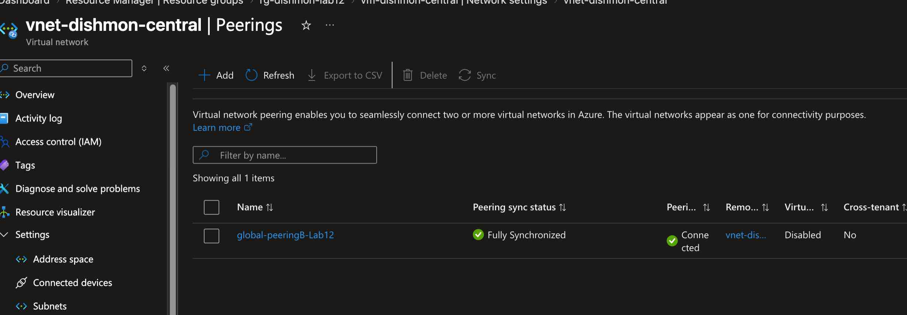
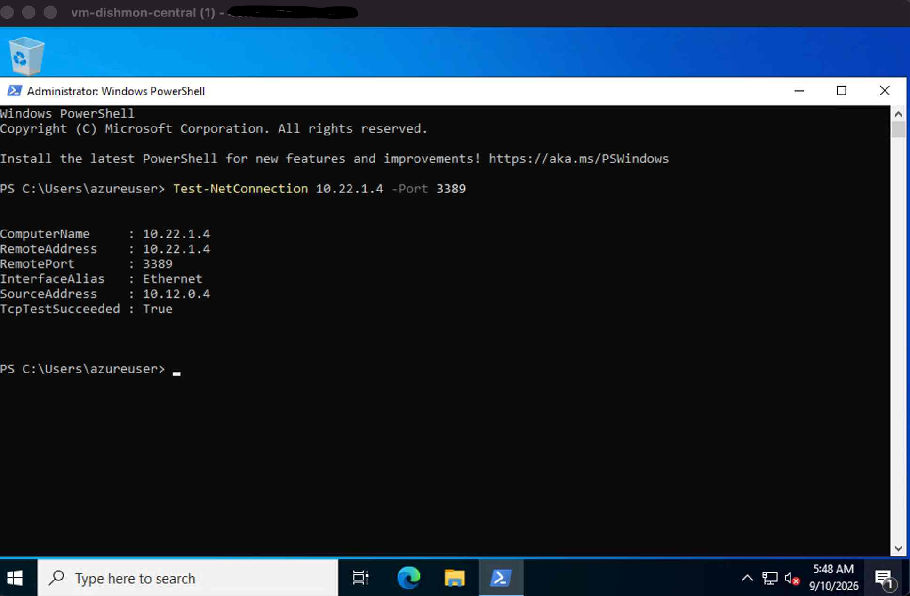
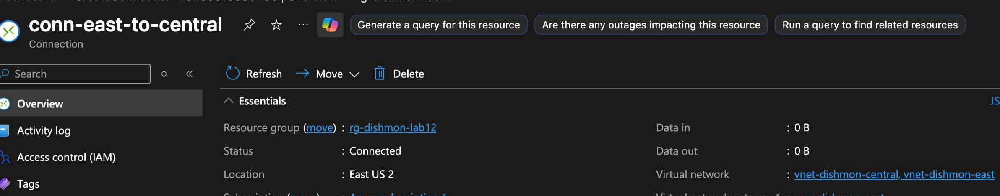
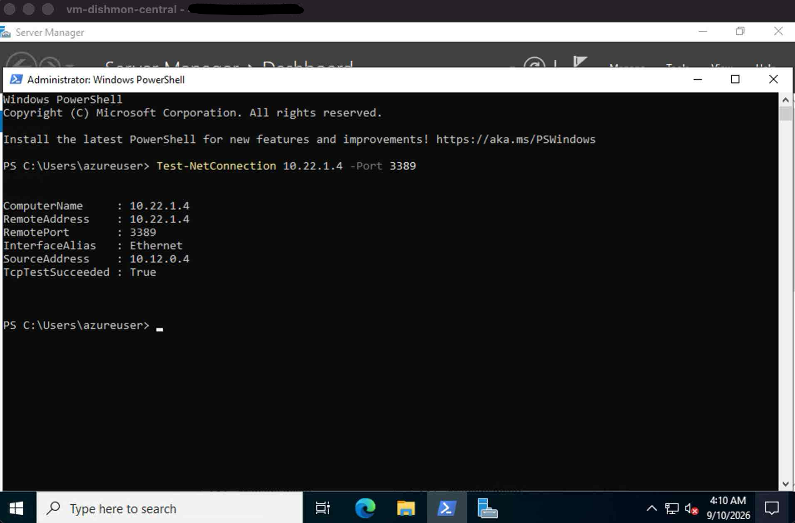

# Lab 12 – VNet Peering & VNet-to-VNet VPN Connectivity

## Overview

This lab compared two Azure virtual network connectivity methods in the fictional **Dishmon Technologies** environment:

- **Global VNet Peering**
- **VNet-to-VNet VPN Gateway connectivity**

The goal was to understand how the two approaches differ in architecture, complexity, cost, and verification while proving that workloads in separate VNets could communicate privately.

---

## Objectives

- Configure Global VNet Peering between two VNets
- Verify private VM-to-VM connectivity
- Create a `GatewaySubnet` in each VNet
- Deploy a Virtual Network Gateway for each VNet
- Create a VNet-to-VNet VPN connection
- Verify the VPN connection reaches `Connected`
- Verify private workload connectivity across the VPN
- Compare peering with gateway-based connectivity
- Clean up temporary, higher-cost gateway resources

---

## Azure Resources

| Resource | Purpose |
|---|---|
| `vnet-dishmon-central` | Central Dishmon Technologies VNet |
| `vnet-dishmon-east` | East-region Dishmon Technologies VNet |
| `GatewaySubnet` | Dedicated subnet required for each VPN gateway |
| Virtual Network Gateway | Azure-managed VPN endpoint for each VNet |
| `conn-east-to-central` | Connection object linking the gateways |

---

## Part 1 – Global VNet Peering

The VNets were first connected with **Global VNet Peering**.

Global VNet Peering allows VNets in different Azure regions to communicate privately over Microsoft’s backbone network without requiring VPN gateways.

The peering showed:

```text
Peering sync status: Fully Synchronized
Peering status: Connected
```



---

## Peering Connectivity Verification

Private connectivity between the VMs was tested with PowerShell:

```powershell
Test-NetConnection 10.22.1.4 -Port 3389
```

The result returned:

```text
TcpTestSucceeded : True
```



The test used private IP addresses:

```text
Source:      10.12.0.4
Destination: 10.22.1.4
Port:        3389
```

This confirmed that the VMs could communicate across the peered VNets.

---

## Peering Traffic Path

```text
VM – Central VNet
        |
        v
 Global VNet Peering
        |
        v
VM – East VNet
```

VNet Peering provides direct VNet-to-VNet connectivity and does not require VPN gateway resources.

---

## Part 2 – VNet-to-VNet VPN Connectivity

The lab then moved to a gateway-based design.

Each VNet required a dedicated subnet named exactly:

```text
GatewaySubnet
```

and its own **Virtual Network Gateway**.

The architecture became:

```text
Central VNet
    |
GatewaySubnet
    |
Virtual Network Gateway
    |
    |  VNet-to-VNet VPN
    |
Virtual Network Gateway
    |
GatewaySubnet
    |
East VNet
```

---

## Virtual Network Gateways

A Virtual Network Gateway was deployed for each VNet with:

```text
Gateway type: VPN
```

These gateways provide the Azure-managed VPN endpoints used for the VNet-to-VNet connection.

Compared with peering, this design requires more infrastructure, takes longer to deploy, and incurs gateway cost.

---

## Connection Object

After both gateways were available, the connection object:

```text
conn-east-to-central
```

was created to link them.

The connection reached:

```text
Status: Connected
```



This confirmed that the gateway-to-gateway connection was established.

Deploying two gateways alone does not automatically connect the VNets; the connection resource is also required.

---

## VPN Connectivity Verification

Private connectivity was tested again after the VNet-to-VNet VPN was established:

```powershell
Test-NetConnection 10.22.1.4 -Port 3389
```

The result again returned:

```text
TcpTestSucceeded : True
```



This confirmed workload connectivity through the gateway-based design.

---

## VNet Peering vs. VNet-to-VNet VPN

| Feature | VNet Peering | VNet-to-VNet VPN |
|---|---|---|
| Connectivity model | Direct between VNets | Through VPN gateways |
| Microsoft backbone | Yes | Yes |
| VPN gateways required | No | Yes |
| `GatewaySubnet` required | No | Yes |
| Deployment complexity | Lower | Higher |
| Gateway cost | No | Yes |
| Encrypted VPN tunnel | No gateway tunnel | Yes |
| Cross-region support | Global VNet Peering | Yes |
| Typical use | Direct Azure VNet connectivity | Gateway-based encrypted connectivity |

---

## Important Concepts

### GatewaySubnet

Azure VPN Gateway requires a subnet named exactly:

```text
GatewaySubnet
```

It is reserved for gateway resources and should not host normal workloads.

### Two Gateways

For the VNet-to-VNet design used in this lab, each VNet had its own Virtual Network Gateway.

### Connection Object

The connection resource links the two gateways. Without it, the gateways exist independently.

### Non-Overlapping Address Spaces

Connected VNets should use non-overlapping address spaces so Azure can route traffic correctly between them.

---

## End-to-End Workflow

```text
Create Central and East VNets
           |
           v
Configure Global VNet Peering
           |
           v
Peering Connected
           |
           v
Verify private connectivity
           |
           v
TcpTestSucceeded = True
           |
           v
Move to gateway-based design
           |
           v
Create GatewaySubnet in both VNets
           |
           v
Deploy two Virtual Network Gateways
           |
           v
Create VNet-to-VNet connection
           |
           v
Connection = Connected
           |
           v
Verify private connectivity again
           |
           v
TcpTestSucceeded = True
```

---

## Verification Results

- Global VNet Peering configured
- Peering status reached `Connected`
- Peering synchronization showed `Fully Synchronized`
- Private TCP connectivity worked across peering
- `GatewaySubnet` created in each VNet
- Virtual Network Gateway deployed for each VNet
- VNet-to-VNet connection created
- VPN connection status reached `Connected`
- Private TCP connectivity worked across the VPN
- Public IP values were redacted from portfolio screenshots where appropriate
- Temporary gateway resources were cleaned up after verification

---

## Key Lessons Learned

- VNet Peering provides direct private connectivity between Azure VNets.
- Global VNet Peering supports VNets in different Azure regions.
- Peering does not require a VPN gateway.
- VNet Peering is generally simpler and less expensive than gateway-based connectivity.
- VNet-to-VNet VPN requires gateway infrastructure.
- Azure VPN Gateway requires a subnet named `GatewaySubnet`.
- Deploying gateways does not by itself connect the VNets; a connection resource is required.
- Private workload connectivity should be tested after configuration rather than relying only on Azure resource status.
- `Test-NetConnection` is useful for verifying TCP connectivity between Azure workloads.
- A `Connected` gateway status plus a successful workload test provides stronger verification.
- Higher-cost temporary gateway resources should be removed when they are no longer needed.

---

## AZ-104 Concepts Practiced

- Azure Virtual Networks
- VNet address spaces
- Subnets
- Global VNet Peering
- Peering status and synchronization
- Private IP connectivity
- Azure VPN Gateway
- Virtual Network Gateway
- `GatewaySubnet`
- VNet-to-VNet connections
- Gateway connection status
- Azure routing concepts
- Cross-region VNet connectivity
- TCP connectivity testing
- PowerShell `Test-NetConnection`
- Connectivity verification
- Cost-aware resource cleanup

---

## Portfolio Evidence

1. **Global VNet Peering Connected**  
   Demonstrates a synchronized and connected Global VNet Peering relationship.

2. **Peering Connectivity Test**  
   Demonstrates successful TCP connectivity between private VM IP addresses over peering.

3. **VNet-to-VNet VPN Connected**  
   Demonstrates the gateway connection reaching `Connected`.

4. **VPN Connectivity Test**  
   Demonstrates successful private workload connectivity after the VPN configuration.

---

## Cleanup

The temporary gateway resources created for this lab were removed after verification.

Azure VPN Gateway resources can incur ongoing charges, so cleanup was performed after the configuration and connectivity tests were complete.

---

## Repository Structure

```text
Lab-12-VNet-Peering-VNet-to-VNet-VPN/
├── README.md
└── screenshots/
    ├── 01-global-vnet-peering-connected.png
    ├── 02-peering-connectivity-test.png
    ├── 03-vnet-to-vnet-vpn-connected.jpg
    └── 04-vpn-connectivity-test.png
```
