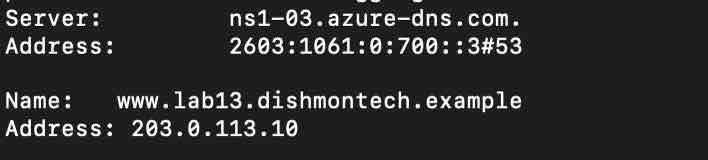
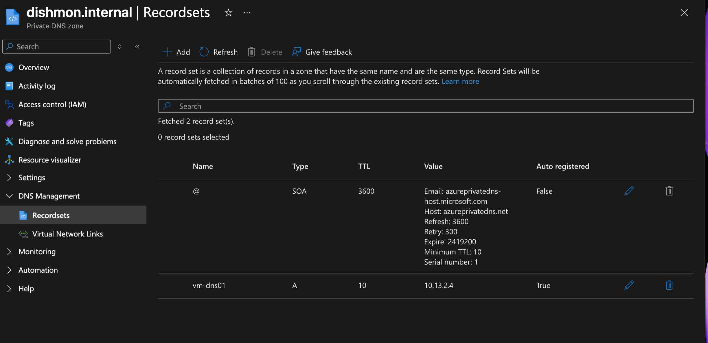
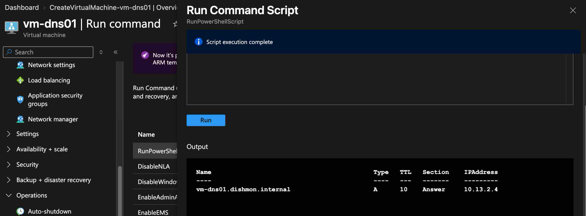

# Lab 13 – Azure DNS: Public & Private Name Resolution

## Overview

This lab focused on **Azure DNS** and the difference between public and private name resolution in the fictional **Dishmon Technologies** environment.

The lab demonstrated how Azure DNS can provide:

- **Public DNS resolution** for internet-facing names
- **Private DNS resolution** for resources inside an Azure virtual network
- **Automatic VM registration** in an Azure Private DNS zone
- DNS verification using Windows name-resolution tools

The lab also reinforced that DNS provides **name-to-IP resolution**; successful name resolution does not by itself prove that two resources can communicate at the application or network level.

---

## Objectives

- Create and configure an Azure Public DNS zone
- Create a public DNS record
- Verify public DNS resolution
- Create an Azure Private DNS zone
- Link the private DNS zone to a virtual network
- Enable automatic registration for VM records
- Verify an automatically registered private A record
- Verify private DNS resolution from an Azure VM
- Understand the difference between public and private DNS behavior
- Clean up temporary Azure resources after verification

---

## Azure DNS Services Used

| Service | Purpose |
|---|---|
| Azure DNS | Hosts public DNS zones and records |
| Azure Private DNS | Provides private name resolution inside Azure VNets |
| Virtual Network Link | Connects a Private DNS zone to a VNet |
| Auto-registration | Automatically creates VM DNS records for linked VNets |

---

## Public DNS

A public DNS name was configured for:

```text
www.lab13.dishmontech.example
```

The record resolved to:

```text
203.0.113.10
```

The address `203.0.113.10` is documentation/test addressing used for lab purposes.

Public DNS resolution was verified successfully:



The result demonstrated that the public DNS record could be queried and resolved through Azure-hosted authoritative DNS servers.

---

## Public DNS Resolution Flow

```text
Client DNS query
      |
      v
Azure DNS authoritative name server
      |
      v
www.lab13.dishmontech.example
      |
      v
203.0.113.10
```

Azure DNS hosts the DNS zone and answers queries for the records stored in that zone.

---

## Private DNS Zone

A Private DNS zone was created for:

```text
dishmon.internal
```

The zone was linked to the lab virtual network so resources in that VNet could resolve names in the private namespace.

The VM:

```text
vm-dns01
```

was automatically registered in the zone with the private IP address:

```text
10.13.2.4
```

The record appeared as:

```text
vm-dns01    A    10.13.2.4
```

and showed:

```text
Auto registered: True
```



---

## Private DNS Auto-Registration

When auto-registration is enabled on a Private DNS virtual network link, supported Azure virtual machines in the linked VNet can automatically receive DNS records in the private zone.

The relationship can be summarized as:

```text
Azure VM
   |
   | Private IP: 10.13.2.4
   v
Linked VNet
   |
   v
Azure Private DNS zone
dishmon.internal
   |
   v
vm-dns01.dishmon.internal
```

This reduces the need to manually maintain DNS A records for every VM in the linked virtual network.

---

## Private DNS Resolution Verification

Private DNS resolution was tested from the Azure VM.

The name:

```text
vm-dns01.dishmon.internal
```

successfully resolved to:

```text
10.13.2.4
```



This verified that:

- the Private DNS zone existed
- the VNet link was working
- the VM record was registered
- the VM could resolve the private DNS name

---

## Public vs. Private DNS

| Feature | Public DNS | Private DNS |
|---|---|---|
| Intended scope | Internet-facing resolution | Private Azure network resolution |
| Query source | Public DNS clients | Resources with access through linked VNets |
| Typical record | Public application or website | Internal VM or service name |
| Example from lab | `www.lab13.dishmontech.example` | `vm-dns01.dishmon.internal` |
| Example address | `203.0.113.10` | `10.13.2.4` |
| VNet link required | No | Yes |
| Auto-registration | No | Supported through VNet link |

---

## DNS Record Concepts

### A Record

An **A record** maps a hostname to an IPv4 address.

Examples from this lab:

```text
www.lab13.dishmontech.example  -> 203.0.113.10
vm-dns01.dishmon.internal      -> 10.13.2.4
```

### SOA Record

The **Start of Authority (SOA)** record contains administrative information about the DNS zone.

Azure automatically creates the SOA record when the zone is created.

### NS Records

**Name Server (NS)** records identify the authoritative DNS servers for a public DNS zone.

Public domain delegation depends on these authoritative name servers.

---

## Important DNS Lesson

Successful name resolution does **not** automatically mean two resources can communicate.

DNS answers:

```text
What IP address belongs to this name?
```

Network connectivity still depends on items such as:

- VNet connectivity
- routing
- NSGs
- firewalls
- service availability
- application ports

This distinction is important both in real Azure administration and on the AZ-104 exam.

---

## End-to-End Workflow

```text
Create Public DNS zone
        |
        v
Create public DNS record
        |
        v
Verify public name resolution
        |
        v
Create Private DNS zone
        |
        v
Link Private DNS zone to VNet
        |
        v
Enable auto-registration
        |
        v
VM receives private DNS record
        |
        v
Resolve vm-dns01.dishmon.internal
        |
        v
10.13.2.4 returned successfully
```

---

## Verification Results

The following tasks were successfully verified:

- Public DNS record configured
- Public DNS name resolved successfully
- Azure Private DNS zone created
- Private DNS zone linked to the VNet
- VM auto-registration enabled
- `vm-dns01` automatically registered
- Private A record mapped to `10.13.2.4`
- `vm-dns01.dishmon.internal` resolved successfully
- Public and private DNS behavior compared
- Temporary resources cleaned up after verification

---

## Key Lessons Learned

- Azure DNS can host authoritative public DNS zones.
- Azure Private DNS provides internal name resolution without exposing records publicly.
- Public DNS and Private DNS solve different name-resolution problems.
- An A record maps a hostname to an IPv4 address.
- Private DNS zones must be linked to a VNet for resources in that VNet to use them.
- Auto-registration can automatically create DNS records for supported VMs in a linked VNet.
- Private DNS names can resolve to RFC1918 private IP addresses.
- DNS resolution alone does not prove application connectivity.
- NS records identify authoritative name servers for a public zone.
- SOA records contain authoritative zone metadata.
- DNS verification should be performed after configuration rather than assuming records are working.

---

## AZ-104 Concepts Practiced

This lab reinforced Azure Administrator concepts including:

- Azure DNS
- Azure Public DNS zones
- Azure Private DNS zones
- DNS record sets
- A records
- NS records
- SOA records
- Authoritative DNS
- Virtual network links
- Private DNS auto-registration
- Private IP name resolution
- Public name resolution
- DNS troubleshooting
- Name resolution vs. network connectivity
- Azure resource cleanup

---

## Portfolio Evidence

1. **Public DNS Resolution Success**  
   Demonstrates successful public name resolution for `www.lab13.dishmontech.example`.

2. **Private DNS Auto-Registration**  
   Demonstrates the automatically registered `vm-dns01` A record in `dishmon.internal`.

3. **Private DNS Resolution Success**  
   Demonstrates successful resolution of `vm-dns01.dishmon.internal` to `10.13.2.4`.

---

## Cleanup

Temporary Azure resources created for this lab were removed after verification was complete.

The screenshots preserve evidence of the DNS configuration and validation without keeping unnecessary lab resources running.

---

## Repository Structure

```text
Lab-13-Azure-DNS/
├── README.md
└── screenshots/
    ├── 01-public-dns-resolution-success.jpg
    ├── 02-private-dns-auto-registration.png
    └── 03-private-dns-resolution-success.png
```
