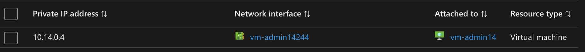
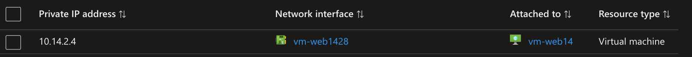
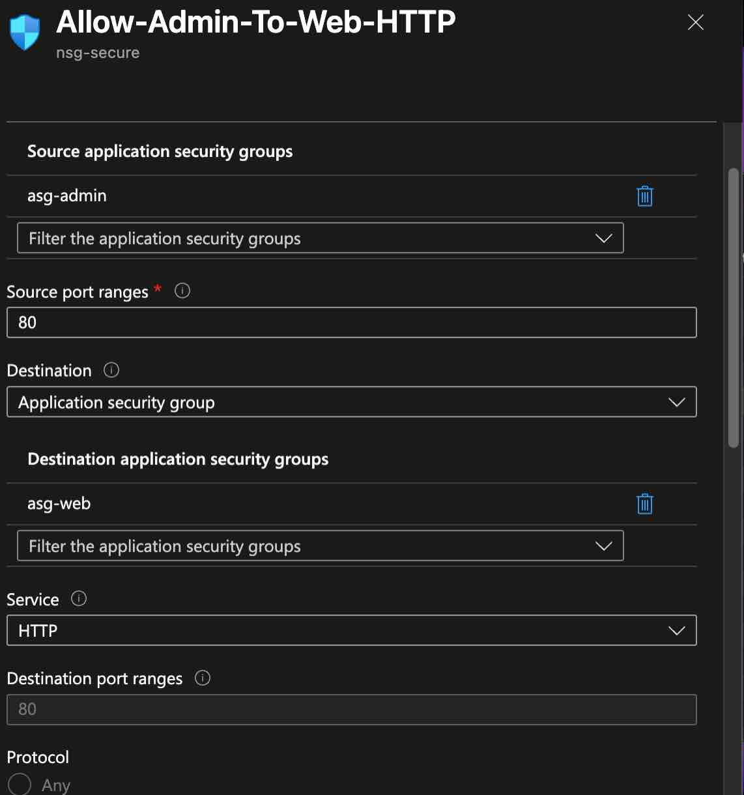
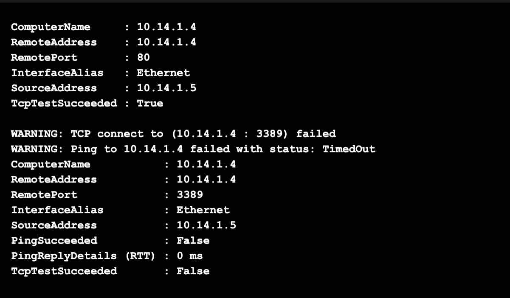
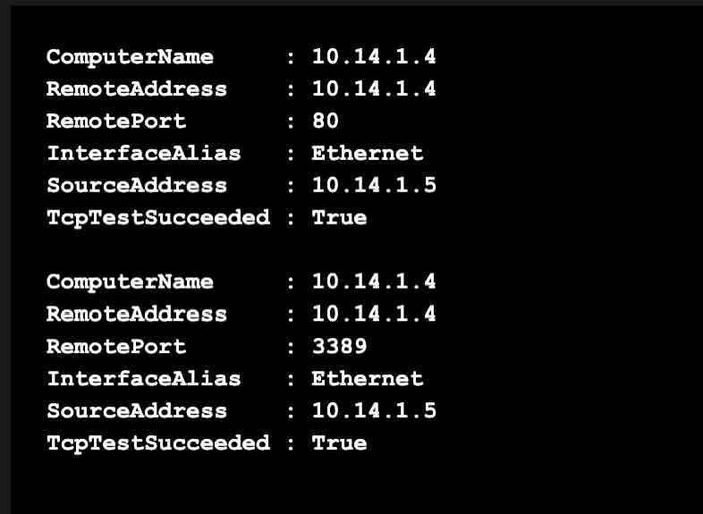

# Lab 14 – NSGs, Application Security Groups & Network Troubleshooting

## Overview

This lab focused on **Network Security Groups (NSGs)**, **Application Security Groups (ASGs)**, NSG rule evaluation, and Azure network troubleshooting in the fictional **Dishmon Technologies** environment.

The lab used an administrative VM and a web VM to practice controlling traffic by workload role instead of relying only on individual IP addresses.

It also included a real troubleshooting scenario involving an incorrectly configured NSG rule, traffic verification, and correction of the rule so the expected connectivity could be restored.

---

## Objectives

- Create and use Application Security Groups
- Assign VM network interfaces to ASGs
- Use ASGs as NSG rule sources and destinations
- Configure HTTP access between workload groups
- Understand source ports versus destination ports
- Review NSG priority and rule processing
- Test TCP connectivity between Azure VMs
- Troubleshoot blocked traffic
- Understand how multiple NSGs affect effective traffic
- Verify the final connectivity behavior
- Clean up temporary Azure resources

---

## Azure Networking Components Used

| Component | Purpose |
|---|---|
| Network Security Group (NSG) | Controls inbound and outbound network traffic |
| Application Security Group (ASG) | Groups VM NICs by application or workload role |
| `asg-admin` | Represents the administrative workload |
| `asg-web` | Represents the web workload |
| TCP 80 | HTTP traffic to the web workload |
| TCP 3389 | RDP traffic used during connectivity testing |

---

## Application Security Groups

Application Security Groups allow administrators to group network interfaces by workload role.

Instead of building NSG rules around specific IP addresses, the rule can reference logical groups such as:

```text
asg-admin
asg-web
```

This makes security rules easier to understand and maintain.

---

## Admin ASG Membership

The administrative VM network interface was assigned to:

```text
asg-admin
```



This allowed NSG rules to treat the administrative VM as part of the admin workload role.

---

## Web ASG Membership

The web VM network interface was assigned to:

```text
asg-web
```



This allowed traffic rules to target the web workload by ASG membership instead of by a hard-coded private IP address.

---

## ASG-Based HTTP Rule

An NSG rule named:

```text
Allow-Admin-To-Web-HTTP
```

was created to permit HTTP traffic from:

```text
asg-admin
```

to:

```text
asg-web
```

using destination port:

```text
TCP 80
```

Using ASGs makes the intent of the rule clear:

```text
Admin workload
      |
      | HTTP / TCP 80
      v
 Web workload
```

---

## Troubleshooting a Source-Port Misconfiguration

During the lab, the HTTP rule was configured incorrectly with:

```text
Source port: 80
Destination port: 80
```



For normal client HTTP traffic, the destination port is TCP 80, but the client usually originates from a dynamically assigned **ephemeral source port**.

Therefore, the source port should normally be:

```text
*
```

or:

```text
Any
```

while the destination port remains:

```text
80
```

This was an important troubleshooting lesson because source and destination ports serve different purposes in an NSG rule.

---

## Source Port vs. Destination Port

A typical HTTP connection looks like:

```text
Client
Source port: ephemeral / dynamic
        |
        | TCP connection
        v
Web server
Destination port: 80
```

An NSG rule that requires the client source port to also be `80` is too restrictive for normal HTTP client traffic.

Correct rule logic:

```text
Source port:      *
Destination port: 80
Protocol:         TCP
```

---

## Connectivity Testing

PowerShell connectivity tests were used to validate network behavior between the VMs.

A test demonstrated that HTTP traffic on TCP 80 succeeded while RDP on TCP 3389 remained blocked:



The result showed:

```text
TCP 80   -> True
TCP 3389 -> False
```

This demonstrated that NSG rules can allow one application flow while denying another.

It also reinforced that successful connectivity on one port does not imply that all traffic between the two VMs is permitted.

---

## NSG Rule Evaluation

NSG rules are processed by **priority**.

Lower numerical values are evaluated before higher numerical values.

For example:

```text
Priority 100
Priority 200
Priority 300
```

is evaluated in that order.

Once traffic matches an applicable rule, Azure uses that rule's action.

This means a higher-priority deny rule can block traffic before a lower-priority allow rule is reached.

---

## Multiple NSGs and Effective Traffic

Azure traffic may be evaluated by more than one NSG, such as:

```text
Subnet NSG
    |
    v
NIC NSG
```

For the traffic to succeed, the relevant NSG evaluations must allow the flow.

If one applicable NSG denies the traffic, the connection is blocked even if another NSG contains an allow rule.

This is an important AZ-104 troubleshooting concept because administrators must consider the **effective security rules**, not just one visible NSG.

---

## Connectivity Restored

After the configuration was corrected and the required NSG rules were aligned, the connectivity tests succeeded as expected:



The verification showed:

```text
TCP 80   -> True
TCP 3389 -> True
```

This confirmed that the final network security configuration allowed the intended traffic.

---

## Troubleshooting Workflow

The lab troubleshooting process can be summarized as:

```text
Assign NICs to ASGs
        |
        v
Create ASG-based NSG rule
        |
        v
Review source and destination ports
        |
        v
Identify source-port misconfiguration
        |
        v
Correct source port to Any / *
        |
        v
Test TCP 80
        |
        v
HTTP succeeds
        |
        v
Test TCP 3389
        |
        v
Traffic blocked
        |
        v
Review effective NSG rules / priorities
        |
        v
Correct required rule configuration
        |
        v
Retest connectivity
        |
        v
Expected traffic succeeds
```

---

## Why ASGs Matter

Without ASGs, a security rule may need to reference individual IP addresses:

```text
10.x.x.x -> 10.x.x.x
```

With ASGs, the same intent can be expressed logically:

```text
asg-admin -> asg-web
```

This improves:

- readability
- scalability
- administration
- workload organization
- security rule maintenance

If a VM's IP changes but its NIC remains in the correct ASG, the NSG rule can continue to apply without rewriting the rule around the new IP.

---

## Verification Results

The following tasks were successfully verified:

- Administrative VM NIC assigned to `asg-admin`
- Web VM NIC assigned to `asg-web`
- NSG rule configured using ASGs
- HTTP traffic targeted to destination port 80
- Source-port misconfiguration identified
- Source and destination port behavior understood
- TCP connectivity tested with PowerShell
- HTTP connectivity succeeded
- RDP traffic was intentionally observed as blocked during troubleshooting
- NSG priority and effective-rule behavior reviewed
- Final required connectivity restored
- Temporary Azure resources cleaned up after verification

---

## Key Lessons Learned

- NSGs filter network traffic using ordered security rules.
- Lower NSG priority numbers are evaluated first.
- ASGs group NICs by application or workload role.
- ASGs make NSG rules easier to manage than hard-coding individual IP addresses.
- HTTP servers listen on destination TCP port 80.
- HTTP clients normally use dynamic or ephemeral source ports.
- Source port and destination port should not be confused.
- One successful TCP test does not prove that every port is allowed.
- Multiple NSGs can participate in the effective traffic decision.
- If one applicable NSG denies traffic, another NSG's allow rule does not override that deny.
- Effective network behavior should be verified rather than inferred from the existence of a rule.
- Troubleshooting should compare the intended traffic flow with the actual NSG rule fields and priorities.

---

## AZ-104 Concepts Practiced

This lab reinforced Azure Administrator concepts including:

- Network Security Groups
- NSG inbound rules
- NSG priorities
- Default and custom security rules
- Application Security Groups
- NIC membership in ASGs
- ASGs as NSG rule sources and destinations
- Source ports
- Destination ports
- HTTP / TCP 80
- RDP / TCP 3389
- Effective security rules
- Multiple NSG evaluation
- TCP connectivity testing
- Azure network troubleshooting
- Least-privilege network access
- Azure resource cleanup

---

## Portfolio Evidence

1. **Admin ASG Membership**  
   Demonstrates the administrative VM network interface assigned to `asg-admin`.

2. **Web ASG Membership**  
   Demonstrates the web VM network interface assigned to `asg-web`.

3. **HTTP Rule Source-Port Misconfiguration**  
   Demonstrates the incorrectly configured source port that was identified during troubleshooting.

4. **Connectivity Blocked**  
   Demonstrates HTTP succeeding while RDP remained blocked.

5. **Connectivity Restored**  
   Demonstrates successful final connectivity after the required NSG configuration was corrected.

---

## Cleanup

Temporary resources created for the lab were removed after verification.

The screenshots preserve the ASG design, NSG troubleshooting process, and connectivity results without keeping unnecessary Azure resources running.

---

## Repository Structure

```text
Lab-14-NSG-ASG-Network-Troubleshooting/
├── README.md
└── screenshots/
    ├── 01-asg-admin-membership.jpg
    ├── 02-asg-web-membership.jpg
    ├── 03-http-rule-source-port-misconfigured.png
    ├── 04-connectivity-blocked.png
    └── 05-connectivity-restored.png
```
