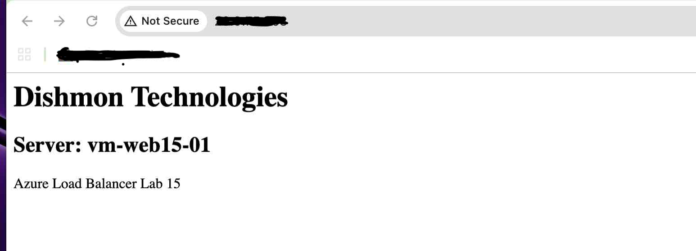
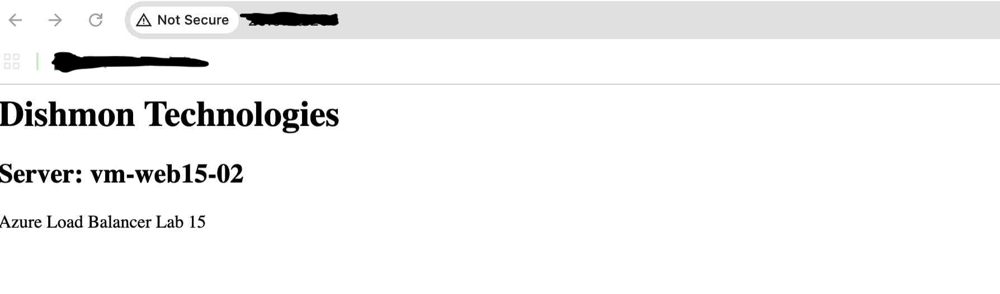
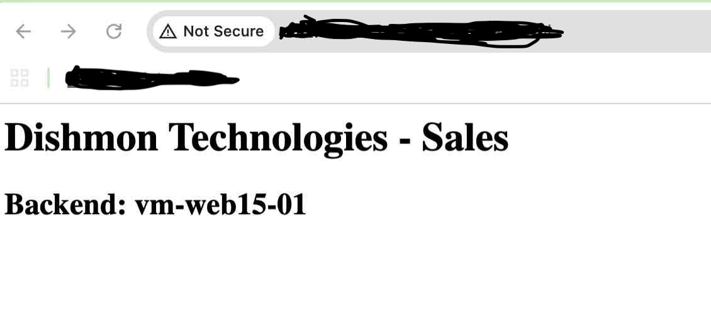
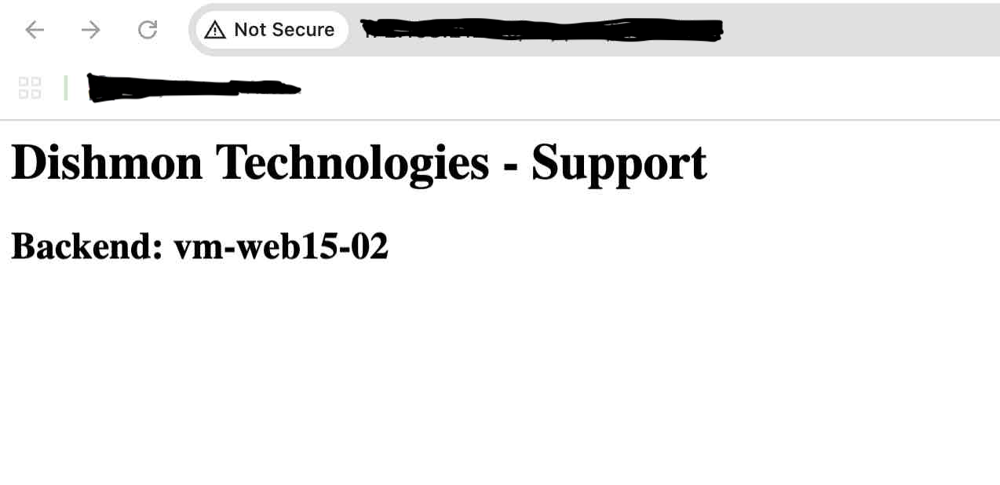

# Lab 15 – Azure Load Balancer & Application Gateway

## Overview

This lab compared two Azure traffic-distribution services in the fictional **Dishmon Technologies** environment:

- **Azure Load Balancer** for Layer 4 traffic distribution
- **Azure Application Gateway** for Layer 7 HTTP routing

Two Windows web servers were configured with IIS and used as backend targets. Azure Load Balancer distributed traffic across the web servers, while Application Gateway used URL path-based routing to send `/sales/` traffic to one backend and `/support/` traffic to another.

The lab also included health-probe testing, backend-health verification, NSG configuration, and troubleshooting of Application Gateway routing components.

---

## Objectives

- Configure two Windows IIS backend servers
- Place both web servers in a Load Balancer backend pool
- Configure a Load Balancer health probe
- Configure a Load Balancer rule for HTTP traffic
- Verify traffic reaches multiple backend VMs
- Configure Application Gateway backend pools
- Configure HTTP backend settings
- Configure a listener and routing rule
- Implement URL path-based routing
- Route `/sales/` traffic to the Sales backend
- Route `/support/` traffic to the Support backend
- Verify Application Gateway backend health
- Compare Layer 4 and Layer 7 load balancing
- Test health-probe behavior by stopping and starting IIS
- Clean up temporary Azure resources

---

## Azure Components Used

| Component | Purpose |
|---|---|
| Azure Load Balancer | Layer 4 TCP/UDP load balancing |
| Azure Application Gateway | Layer 7 HTTP/HTTPS routing |
| Backend Pool | Groups backend VMs that can receive traffic |
| Health Probe | Determines whether a backend should receive traffic |
| Load Balancing Rule | Connects frontend traffic to the backend pool |
| Listener | Accepts Application Gateway HTTP traffic |
| Backend Setting | Defines how Application Gateway communicates with a backend |
| Path-Based Routing Rule | Routes requests according to the URL path |
| Network Security Group | Allows the required traffic to backend workloads |
| IIS | Provides the web content used for verification |

---

## Backend Web Servers

Two Windows virtual machines were configured as IIS web servers:

```text
vm-web15-01
vm-web15-02
```

Each server displayed its hostname on the root page. This made it easy to confirm which backend handled a Load Balancer request.

The web servers were configured with the reusable PowerShell script:

```text
scripts/Lab15-WebServer-Setup.ps1
```

---

## PowerShell Web Server Setup

The preserved PowerShell script accepts one of two roles:

```powershell
.\Lab15-WebServer-Setup.ps1 -Role Sales
```

or:

```powershell
.\Lab15-WebServer-Setup.ps1 -Role Support
```

The script:

- installs IIS
- creates a root test page
- displays the current server hostname
- creates a Sales or Support directory
- creates a path-specific test page
- preserves IIS stop/start commands used during health-probe testing

The root page was used for Azure Load Balancer testing:

```text
/
```

The Application Gateway pages were:

```text
/sales/index.html
/support/index.html
```

---

## Part 1 – Azure Load Balancer

Azure Load Balancer distributes TCP or UDP traffic using Layer 4 information such as:

```text
Source IP
Destination IP
Source port
Destination port
Protocol
```

It does not inspect URL paths such as `/sales/` or `/support/`.

The two IIS VMs were added to the Load Balancer backend pool and configured to receive HTTP traffic.

---

## Health Probe

A health probe was configured so the Load Balancer could determine whether each IIS server was healthy enough to receive traffic.

Conceptually:

```text
Azure Load Balancer
        |
        | Health probe
        v
+-------------------+
| vm-web15-01       |
+-------------------+

+-------------------+
| vm-web15-02       |
+-------------------+
```

If a backend fails the health probe, the Load Balancer stops sending new traffic to that backend until it becomes healthy again.

During the lab, IIS could be stopped and restarted with:

```powershell
Stop-Service W3SVC
Start-Service W3SVC
```

This provided a practical way to observe health-probe behavior.

---

## Load Balancing Rule

The Load Balancing rule tied together the major Layer 4 components:

```text
Frontend IP
    |
    v
Load Balancing Rule
    |
    +---- Health Probe
    |
    v
Backend Pool
    |
    +---- vm-web15-01
    |
    +---- vm-web15-02
```

This relationship is important because simply creating a frontend IP and backend pool does not by itself establish the traffic flow.

---

## Load Balancer Verification

Repeated requests to the Load Balancer frontend showed traffic reaching both backend servers.

### Backend 01



The page identified:

```text
Server: vm-web15-01
```

### Backend 02



The page identified:

```text
Server: vm-web15-02
```

Together, these screenshots demonstrate that the Layer 4 Load Balancer distributed requests across multiple healthy backend servers.

---

## Part 2 – Azure Application Gateway

Azure Application Gateway operates at Layer 7 and understands HTTP/HTTPS application information.

Unlike Azure Load Balancer, it can make routing decisions based on URL paths.

The Dishmon Technologies design used:

```text
/sales/*
/support/*
```

to direct users to different backend servers.

---

## Application Gateway Architecture

The Application Gateway request flow was:

```text
Client
  |
  v
Frontend IP
  |
  v
Listener
  |
  v
Path-Based Routing Rule
  |
  +---- /sales/*   ----> Sales backend
  |
  +---- /support/* ----> Support backend
```

The routing rule connects the listener to the appropriate backend target and backend HTTP settings.

---

## Backend Health

Application Gateway backend health was checked before final routing verification.

A healthy backend indicates that Application Gateway can successfully reach the configured backend target using the associated backend settings and probe behavior.

Backend health is important because a correct path rule cannot successfully serve traffic if the target backend is unhealthy.

---

## Sales Path Routing

The `/sales/` path was configured to route to:

```text
vm-web15-01
```

Verification:



The page returned:

```text
Dishmon Technologies - Sales
Backend: vm-web15-01
```

This demonstrated that Application Gateway inspected the request path and selected the Sales backend.

---

## Support Path Routing

The `/support/` path was configured to route to:

```text
vm-web15-02
```

Verification:



The page returned:

```text
Dishmon Technologies - Support
Backend: vm-web15-02
```

This demonstrated successful path-based routing to a different backend.

---

## Load Balancer vs. Application Gateway

| Feature | Azure Load Balancer | Azure Application Gateway |
|---|---|---|
| OSI layer | Layer 4 | Layer 7 |
| Primary protocols | TCP / UDP | HTTP / HTTPS |
| Understands URL paths | No | Yes |
| Backend health checks | Yes | Yes |
| Typical routing decision | IP + port + protocol | Hostname / URL path / HTTP settings |
| Path-based routing | No | Yes |
| Example from this lab | Distribute HTTP traffic across both web VMs | Route Sales and Support paths to different backends |

---

## Troubleshooting Lessons

The Application Gateway configuration reinforced that several components must align:

```text
Frontend
   |
Listener
   |
Routing Rule
   |
Path Map
   |
Backend Target
   |
Backend Setting
   |
Healthy Backend
```

If one component is missing or points to the wrong target, the application request will not be routed as intended.

The lab also reinforced the importance of checking **Backend Health** rather than assuming the backend is reachable simply because the VM is running.

---

## End-to-End Workflow

```text
Deploy two web VMs
       |
       v
Install IIS and test pages
       |
       v
Create Load Balancer
       |
       v
Add VMs to backend pool
       |
       v
Configure health probe
       |
       v
Configure load balancing rule
       |
       v
Verify requests reach both VMs
       |
       v
Create Application Gateway
       |
       v
Configure backend pools/settings
       |
       v
Configure listener
       |
       v
Configure path-based routing
       |
       +---- /sales/*   -> vm-web15-01
       |
       +---- /support/* -> vm-web15-02
       |
       v
Verify backend health
       |
       v
Verify both URL paths
```

---

## Verification Results

The following tasks were successfully verified:

- IIS configured on both backend VMs
- Root Load Balancer test page deployed
- Sales and Support path-specific pages deployed
- Both VMs added to the Load Balancer backend pool
- Load Balancer health probe configured
- Load Balancing rule configured
- Requests reached `vm-web15-01`
- Requests reached `vm-web15-02`
- Application Gateway backend pools configured
- Application Gateway backend health verified
- Listener and routing components configured
- `/sales/` routed to `vm-web15-01`
- `/support/` routed to `vm-web15-02`
- Layer 4 and Layer 7 behavior compared
- Health-probe testing commands preserved
- Temporary Azure resources cleaned up after verification

---

## Key Lessons Learned

- Azure Load Balancer is a Layer 4 service.
- Application Gateway is a Layer 7 service.
- Load Balancer uses IP, port, and protocol information rather than URL paths.
- Application Gateway can route traffic using application-aware information such as URL paths.
- A Load Balancing rule connects frontend configuration to the backend pool.
- Health probes determine whether backends should receive traffic.
- An unhealthy backend should not receive new load-balanced traffic.
- Application Gateway requires its listener, routing rule, backend target, and backend settings to align.
- Backend Health is a key Application Gateway troubleshooting tool.
- Path-based routing is useful when different application paths need different backend workloads.
- Verification should test actual client traffic, not just resource deployment status.
- Stopping and starting IIS is a useful lab technique for observing backend health behavior.

---

## AZ-104 Concepts Practiced

This lab reinforced Azure Administrator concepts including:

- Azure Load Balancer
- Layer 4 load balancing
- Frontend IP configuration
- Backend pools
- Health probes
- Load Balancing rules
- Azure Application Gateway
- Layer 7 routing
- Listeners
- Backend pools
- Backend settings
- Backend health
- Path-based routing
- URL path maps
- NSG traffic requirements
- IIS administration
- PowerShell automation
- Application availability testing
- Azure network troubleshooting
- Cost-aware resource cleanup

---

## Portfolio Evidence

1. **Load Balancer Backend 01**  
   Demonstrates Load Balancer traffic reaching `vm-web15-01`.

2. **Load Balancer Backend 02**  
   Demonstrates Load Balancer traffic reaching `vm-web15-02`.

3. **Application Gateway Sales Route**  
   Demonstrates `/sales/` path-based routing to `vm-web15-01`.

4. **Application Gateway Support Route**  
   Demonstrates `/support/` path-based routing to `vm-web15-02`.

---

## Cleanup

Temporary resources created for this lab were removed after verification.

Application Gateway and other compute/networking resources can incur ongoing charges, so the environment was cleaned up once traffic distribution, path-based routing, and health behavior were verified.

---

## Repository Structure

```text
Lab-15-Load-Balancer-Application-Gateway/
├── README.md
├── scripts/
│   └── Lab15-WebServer-Setup.ps1
└── screenshots/
    ├── 01-load-balancer-backend-01.png
    ├── 02-load-balancer-backend-02.png
    ├── 03-app-gateway-sales-route.png
    └── 04-app-gateway-support-route.png
```
