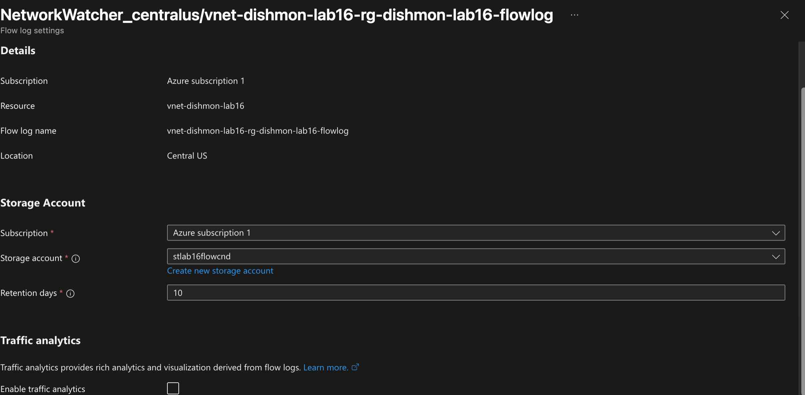
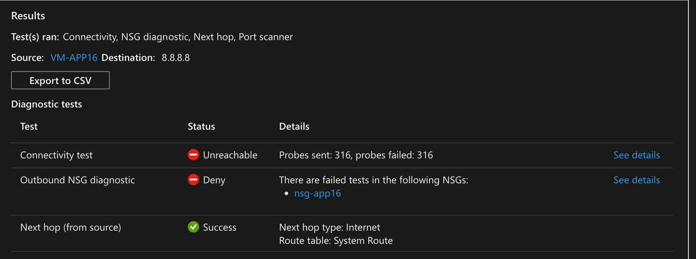
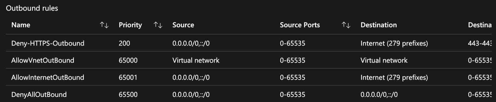
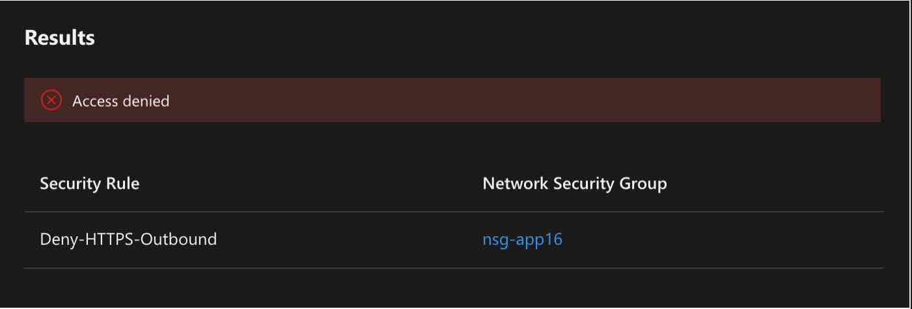
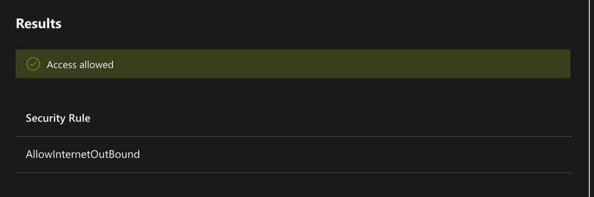

# Lab 16 – Network Watcher & Network Diagnostics

## Overview

This lab focused on **Azure Network Watcher** and practical network troubleshooting in the fictional **Dishmon Technologies** environment.

A virtual machine with an outbound NSG rule was intentionally placed into a failure condition. Azure networking diagnostic tools were then used to determine whether the problem was caused by routing or security filtering, identify the exact NSG rule responsible for the failure, remediate the configuration, and verify that traffic was allowed afterward.

The lab also configured **Virtual Network Flow Logs** to capture network-flow information for later analysis.

---

## Objectives

- Configure Virtual Network Flow Logs
- Store flow-log data in an Azure Storage account
- Configure log retention
- Use Connection Troubleshoot
- Interpret connectivity and NSG diagnostic results
- Use Next Hop to validate routing
- Review effective outbound NSG rules
- Use IP Flow Verify to identify the exact blocking rule
- Remediate the NSG configuration
- Verify that outbound traffic is allowed after remediation
- Understand the difference between routing problems and NSG filtering
- Clean up temporary Azure resources after verification

---

## Azure Networking Components Used

| Component | Purpose |
|---|---|
| Azure Network Watcher | Provides network monitoring and diagnostic tools |
| Virtual Network Flow Logs | Records network flow information for a VNet |
| Azure Storage account | Stores flow-log data |
| Connection Troubleshoot | Tests end-to-end connectivity and related diagnostics |
| Next Hop | Shows how Azure intends to route traffic |
| Effective Security Rules | Shows the combined NSG rules that apply to a NIC |
| IP Flow Verify | Determines whether a specific packet would be allowed or denied |
| Network Security Group | Filters inbound and outbound traffic |

---

## Lab Scenario

The application VM used the NSG:

```text
nsg-app16
```

A custom outbound rule named:

```text
Deny-HTTPS-Outbound
```

was configured with a high enough priority to take precedence over Azure's default outbound Internet allow rule.

The result was that HTTPS traffic was blocked even though Azure still had a valid route to the Internet.

This created an ideal troubleshooting scenario:

```text
VM has valid route
      |
      v
Next Hop = Internet
      |
      v
NSG evaluates traffic
      |
      v
Deny-HTTPS-Outbound matches first
      |
      v
Traffic denied
```

---

## Virtual Network Flow Logs

A flow log was configured for:

```text
vnet-dishmon-lab16
```

The configuration stored flow information in an Azure Storage account with a retention period of:

```text
10 days
```



Flow logs provide historical network-flow information that can support troubleshooting, monitoring, and traffic analysis.

Traffic Analytics was not required for the core troubleshooting workflow in this lab.

---

## Connection Troubleshoot

Connection Troubleshoot was used from:

```text
VM-APP16
```

to:

```text
8.8.8.8
```

The results showed:

```text
Connectivity test: Unreachable
Outbound NSG diagnostic: Deny
Next hop: Success
Next hop type: Internet
```



This was an important diagnostic result.

The **Next Hop** test succeeded, which meant Azure knew how to route the traffic toward the Internet.

At the same time, the **Outbound NSG diagnostic** reported a deny.

That narrowed the problem from:

```text
"Network connectivity is broken"
```

to:

```text
"Routing is valid, but an NSG is blocking the traffic"
```

---

## Routing vs. Security Filtering

A valid route does not guarantee successful connectivity.

The troubleshooting logic can be summarized as:

```text
Is there a valid route?
        |
        +---- No ---> Investigate route tables / next hop
        |
        +---- Yes
               |
               v
       Is traffic allowed?
               |
               +---- No ---> Investigate NSGs / firewalls
               |
               +---- Yes --> Continue application-level troubleshooting
```

In this lab:

```text
Next Hop = Internet
```

but:

```text
Outbound NSG diagnostic = Deny
```

So the issue was security filtering rather than routing.

---

## Effective Outbound Security Rules

The effective outbound rules revealed the custom rule:

```text
Deny-HTTPS-Outbound
```

with priority:

```text
200
```



The rule targeted Internet-bound HTTPS traffic.

Azure also displayed the default rule:

```text
AllowInternetOutBound
```

at priority:

```text
65001
```

Because NSG rules are evaluated from lower priority number to higher priority number, the custom priority `200` rule was processed before the default priority `65001` allow rule.

Therefore:

```text
Deny-HTTPS-Outbound   Priority 200
        |
        v
MATCHES FIRST
        |
        v
Traffic denied

AllowInternetOutBound Priority 65001
        |
        v
Never reached for that flow
```

---

## IP Flow Verify – Denied

IP Flow Verify was then used to test the specific traffic flow.

The result was:

```text
Access denied
```

and Azure identified the exact rule:

```text
Deny-HTTPS-Outbound
```

in:

```text
nsg-app16
```



This is one of the strongest troubleshooting tools in Network Watcher because it answers two questions at once:

```text
Would this traffic be allowed or denied?
Which NSG rule makes that decision?
```

Instead of manually guessing which NSG rule caused the failure, IP Flow Verify identified the blocking rule directly.

---

## Remediation

The NSG configuration was corrected so that the custom HTTPS deny rule no longer blocked the required outbound flow.

After remediation, IP Flow Verify was run again.

The result changed to:

```text
Access allowed
```

and the matching rule became:

```text
AllowInternetOutBound
```



This proved that the NSG configuration had been successfully corrected.

---

## Troubleshooting Workflow

The complete troubleshooting process was:

```text
Configure flow logging
        |
        v
Observe connectivity failure
        |
        v
Run Connection Troubleshoot
        |
        +---- Connectivity = Unreachable
        |
        +---- Outbound NSG = Deny
        |
        +---- Next Hop = Internet
        |
        v
Routing confirmed valid
        |
        v
Review Effective Security Rules
        |
        v
Find Deny-HTTPS-Outbound priority 200
        |
        v
Run IP Flow Verify
        |
        v
Access denied
Blocking rule identified
        |
        v
Remediate NSG configuration
        |
        v
Run IP Flow Verify again
        |
        v
Access allowed
```

---

## Network Watcher Tool Comparison

| Tool | Question It Answers |
|---|---|
| Connection Troubleshoot | Can this source reach this destination, and where is the failure? |
| Next Hop | Which route will Azure use for this traffic? |
| Effective Security Rules | Which NSG rules currently apply to this NIC? |
| IP Flow Verify | Would this specific flow be allowed or denied, and by which rule? |
| Flow Logs | What network flows have occurred over time? |

These tools are related, but they answer different troubleshooting questions.

---

## Key Lessons Learned

- Network Watcher provides multiple tools that should be used together rather than interchangeably.
- Connection Troubleshoot provides a broad end-to-end view of a connectivity problem.
- Next Hop validates the routing decision, not whether the packet will ultimately be allowed.
- A correct route can exist while an NSG still blocks the traffic.
- Effective Security Rules show the combined NSG rules that apply to a NIC.
- Lower NSG priority numbers are evaluated before higher numbers.
- A custom deny rule can override Azure's default `AllowInternetOutBound` rule by using a lower priority number.
- IP Flow Verify identifies both the allow/deny result and the specific matching NSG rule.
- Troubleshooting should isolate whether the failure is caused by routing, security filtering, or the application itself.
- Verification after remediation is necessary to prove that the change solved the problem.
- Flow logs provide historical traffic data, while IP Flow Verify evaluates a specific traffic flow.

---

## AZ-104 Concepts Practiced

This lab reinforced Azure Administrator concepts including:

- Azure Network Watcher
- Virtual Network Flow Logs
- Flow-log storage
- Log retention
- Connection Troubleshoot
- Next Hop
- Effective Security Rules
- IP Flow Verify
- Network Security Groups
- NSG outbound rules
- NSG rule priorities
- Default NSG rules
- Internet service tags
- Routing vs. security filtering
- Network diagnostics
- Connectivity verification
- Network troubleshooting methodology
- Azure resource cleanup

---

## Verification Results

The following tasks were successfully verified:

- Virtual Network Flow Log configured
- Flow-log storage account configured
- 10-day retention configured
- Connection Troubleshoot detected unreachable traffic
- Outbound NSG diagnostic identified a deny
- Next Hop successfully resolved to the Internet
- Effective Security Rules exposed the custom deny rule
- `Deny-HTTPS-Outbound` identified at priority 200
- IP Flow Verify returned `Access denied`
- IP Flow Verify identified `Deny-HTTPS-Outbound` as the matching rule
- NSG configuration remediated
- IP Flow Verify returned `Access allowed`
- `AllowInternetOutBound` became the matching rule after remediation
- Temporary lab resources cleaned up after verification

---

## Portfolio Evidence

1. **VNet Flow Log Configuration**  
   Demonstrates flow logging, storage, and retention configuration.

2. **Connection Troubleshoot Denied**  
   Demonstrates an unreachable connection, NSG deny result, and successful Internet next-hop decision.

3. **Effective Outbound Security Rules**  
   Demonstrates the priority relationship between the custom HTTPS deny rule and Azure's default outbound Internet allow rule.

4. **IP Flow Verify Denied**  
   Demonstrates Network Watcher identifying the exact NSG rule responsible for the denied traffic.

5. **IP Flow Verify Remediated**  
   Demonstrates successful verification after the NSG configuration was corrected.

---

## Cleanup

Temporary Azure resources created for the lab were removed after troubleshooting and verification were complete.

The screenshots preserve the diagnostic process and remediation evidence without keeping unnecessary lab resources running.

---

## Repository Structure

```text
Lab-16-Network-Watcher-Network-Diagnostics/
├── README.md
└── screenshots/
    ├── 01-vnet-flow-log-configuration.png
    ├── 02-connection-troubleshoot-denied.png
    ├── 03-effective-outbound-security-rules.png
    ├── 04-ip-flow-verify-denied.png
    └── 05-ip-flow-verify-remediated.png
```
