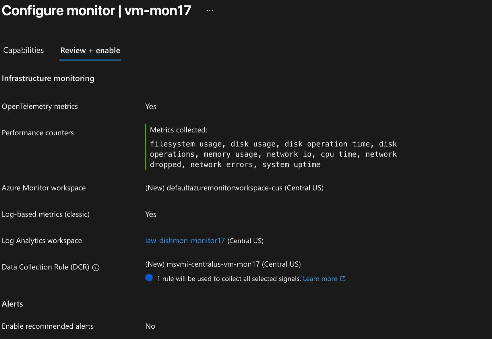
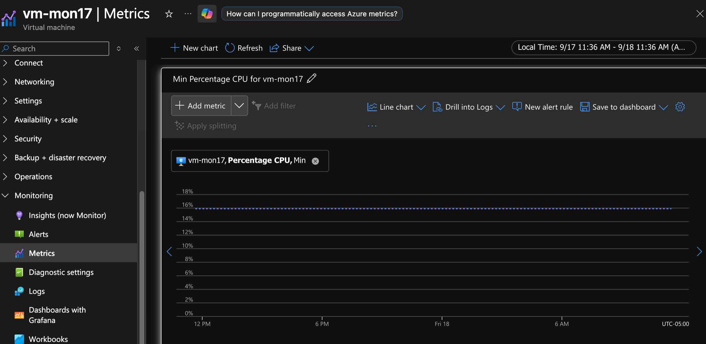
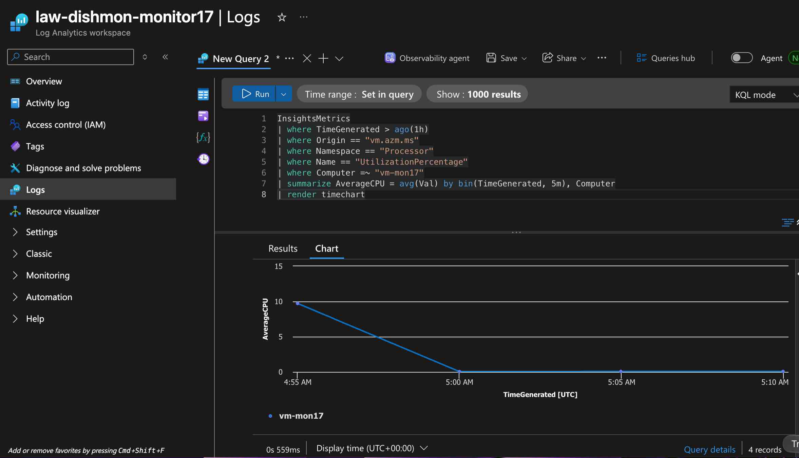
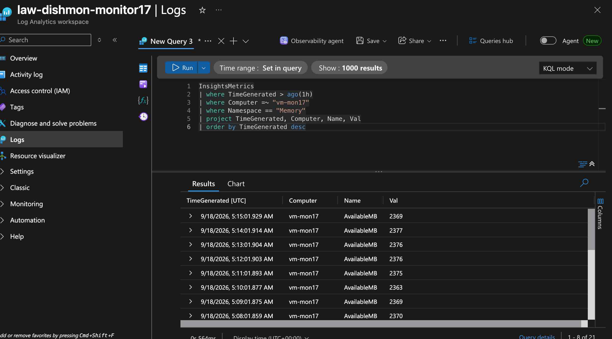

# Lab 17 – Azure Monitor, VM Insights & Log Analytics

## Overview

This lab focused on monitoring and analyzing an Azure virtual machine in the fictional **Dishmon Technologies** environment using **Azure Monitor**, **VM Insights**, **Log Analytics**, and **Kusto Query Language (KQL)**.

The lab demonstrated the difference between viewing Azure platform metrics directly in Azure Monitor and collecting guest-level telemetry into a Log Analytics workspace for deeper analysis. Monitoring was enabled for `vm-mon17`, telemetry was collected through a Data Collection Rule (DCR), and KQL queries were used to verify and analyze CPU and memory data.

---

## Objectives

- Review Azure Monitor metrics for an Azure virtual machine
- Enable VM monitoring / VM Insights
- Send guest telemetry to a Log Analytics workspace
- Use a Data Collection Rule to collect selected VM signals
- Verify that guest telemetry reaches Log Analytics
- Query `InsightsMetrics` using KQL
- Analyze CPU utilization over time
- Review memory telemetry
- Visualize query results with a KQL time chart
- Distinguish Azure platform metrics from guest-level monitoring data
- Verify monitoring functionality before cleanup

---

## Azure Resources and Monitoring Components

| Component | Purpose |
|---|---|
| Azure Monitor | Central monitoring service for Azure resources |
| Azure Monitor Metrics | Provides near-real-time numeric platform measurements |
| VM Insights / Monitor | Adds deeper monitoring for virtual machines |
| Log Analytics workspace | Stores log and guest telemetry for querying |
| Data Collection Rule (DCR) | Defines which monitoring data is collected and where it is sent |
| `InsightsMetrics` | Log Analytics table containing VM Insights metric data |
| Kusto Query Language (KQL) | Query language used to analyze Log Analytics data |

---

## Lab Environment

The primary monitored virtual machine was:

```text
vm-mon17
```

The Log Analytics workspace used for guest telemetry was:

```text
law-dishmon-monitor17
```

The VM monitoring configuration included a Data Collection Rule for the selected signals.

---

## 1. Configure VM Monitoring

Monitoring was enabled for `vm-mon17`.

The configuration showed:

- OpenTelemetry metrics enabled
- Performance counters selected
- Azure Monitor workspace configured
- Log-based metrics enabled
- Log Analytics workspace `law-dishmon-monitor17`
- Data Collection Rule created for the VM

The selected performance telemetry included operating-system signals such as CPU, memory, disk, filesystem, network, and uptime measurements.



### Why This Matters

Azure Monitor can provide platform metrics without installing guest monitoring components, but deeper operating-system telemetry requires additional monitoring configuration.

The Data Collection Rule defines which signals are collected and controls the monitoring pipeline for the VM.

---

## 2. Review Azure Monitor Metrics

Azure Monitor Metrics was used to view CPU information for `vm-mon17`.

The portal displayed the VM's:

```text
Percentage CPU
```

metric using the:

```text
Min
```

aggregation.



This demonstrates Azure's built-in metric monitoring capability.

### Platform Metrics vs. Guest Telemetry

A useful distinction from this lab is:

```text
Azure Monitor Metrics
        |
        v
Numeric platform measurements
available directly from Azure resources

VM Insights / Log Analytics
        |
        v
Collected guest telemetry
stored for deeper querying and analysis
```

Platform metrics and Log Analytics data are both part of Azure Monitor, but they are stored and queried differently.

---

## 3. Verify Guest Telemetry with KQL

The first KQL query verifies that VM Insights telemetry is reaching Log Analytics for `vm-mon17`.

```kusto
InsightsMetrics
| where TimeGenerated > ago(1h)
| where Computer =~ "vm-mon17"
| take 20;
```

This query confirms that records for the VM exist in the `InsightsMetrics` table.

The full reusable query file is stored at:

```text
queries/Lab17-AzureMonitor-Queries.kql
```

---

## 4. Analyze CPU Utilization with KQL

The CPU query filters VM Insights telemetry to processor utilization data for `vm-mon17`.

```kusto
InsightsMetrics
| where TimeGenerated > ago(1h)
| where Origin == "vm.azm.ms"
| where Namespace == "Processor"
| where Name == "UtilizationPercentage"
| where Computer =~ "vm-mon17"
| summarize AverageCPU = avg(Val) by bin(TimeGenerated, 5m), Computer
| render timechart;
```

The query:

1. Limits results to the previous hour
2. Filters to the VM Insights data origin
3. Selects the `Processor` namespace
4. Selects `UtilizationPercentage`
5. Filters to `vm-mon17`
6. Calculates average CPU values in 5-minute intervals
7. Renders the results as a time chart



### KQL Concepts Practiced

This query reinforced several important KQL operators:

```text
where       -> filter records
summarize   -> aggregate values
avg()       -> calculate an average
bin()       -> group timestamps into intervals
render      -> visualize query results
```

---

## 5. Review Memory Guest Telemetry

The memory query filters `InsightsMetrics` to the `Memory` namespace for `vm-mon17`.

```kusto
InsightsMetrics
| where TimeGenerated > ago(1h)
| where Computer =~ "vm-mon17"
| where Namespace == "Memory"
| project TimeGenerated, Computer, Name, Val
| order by TimeGenerated desc;
```

The query returned memory data including records such as:

```text
AvailableMB
```



### KQL Concepts Practiced

The memory query reinforced:

```text
project     -> select the columns to display
order by    -> sort query results
desc        -> newest records first
```

---

## Monitoring Data Flow

The monitoring workflow can be summarized as:

```text
vm-mon17
   |
   +----------------------+
   |                      |
   v                      v
Azure platform       Guest monitoring
metrics              configuration
   |                      |
   v                      v
Azure Monitor        Data Collection Rule
Metrics                  |
                          v
                 Log Analytics workspace
                 law-dishmon-monitor17
                          |
                          v
                    InsightsMetrics
                          |
                          v
                      KQL queries
```

This distinction is important when troubleshooting Azure monitoring because not all monitoring data is stored in the same location.

---

## Troubleshooting and Verification

The monitoring configuration was validated by confirming that:

- `vm-mon17` exposed Azure Monitor platform metrics
- VM monitoring was successfully enabled
- The Log Analytics workspace was connected
- A Data Collection Rule was configured
- Guest telemetry appeared in `InsightsMetrics`
- CPU telemetry could be filtered and summarized
- CPU results could be rendered as a time chart
- Memory telemetry returned records for the VM

The successful KQL results proved that the guest monitoring pipeline was functioning.

---

## Azure Monitor vs. Log Analytics

| Azure Monitor Concept | Role in This Lab |
|---|---|
| Metrics | Viewed numeric VM measurements through the Azure portal |
| VM Insights / Monitor | Enabled deeper VM monitoring |
| Data Collection Rule | Defined the monitoring data collection configuration |
| Log Analytics | Stored collected guest telemetry |
| KQL | Queried and analyzed telemetry stored in Log Analytics |
| `InsightsMetrics` | Provided guest metric records for CPU and memory analysis |

A common AZ-104 distinction is that **Azure Monitor** is the broader monitoring platform, while a **Log Analytics workspace** is a destination that stores log and telemetry data that can be queried with KQL.

---

## Key Lessons Learned

- Azure Monitor is the umbrella monitoring service for Azure resources.
- Metrics provide numeric measurements over time.
- Platform metrics can be available without configuring a Log Analytics workspace.
- VM guest telemetry requires additional monitoring configuration.
- Data Collection Rules define what monitoring data is collected and where it is sent.
- Log Analytics provides a central location for storing and querying monitoring data.
- KQL is used to analyze data stored in Log Analytics.
- `InsightsMetrics` can contain VM Insights telemetry for processor and memory monitoring.
- `where` filters data before analysis.
- `summarize` performs aggregation.
- `bin()` groups time-series data into defined intervals.
- `render timechart` converts query results into a time-series visualization.
- `project` limits output to selected columns.
- Monitoring should be verified by querying the collected data rather than assuming configuration alone means collection is working.

---

## AZ-104 Concepts Practiced

This lab reinforced Azure Administrator topics including:

- Azure Monitor
- Azure Monitor Metrics
- VM Insights / VM Monitor
- Log Analytics workspaces
- Data Collection Rules
- Guest telemetry
- Performance counters
- `InsightsMetrics`
- Kusto Query Language
- Time-range filtering
- KQL aggregation
- KQL visualization
- CPU monitoring
- Memory monitoring
- Monitoring verification
- Diagnostic and monitoring data collection
- Azure resource cleanup

---

## Verification Results

The following objectives were successfully verified:

- Azure Monitor metric displayed for `vm-mon17`
- VM monitoring enabled
- Log Analytics workspace configured
- Data Collection Rule configured
- Guest telemetry successfully collected
- `InsightsMetrics` returned VM records
- CPU utilization queried with KQL
- CPU utilization summarized in 5-minute intervals
- CPU query rendered as a time chart
- Memory telemetry queried successfully
- KQL queries preserved for reuse
- Temporary lab resources cleaned up after verification

---

## Portfolio Evidence

1. **VM Monitor Configuration**  
   Demonstrates VM monitoring configuration, Log Analytics integration, performance telemetry, and the Data Collection Rule.

2. **Azure Monitor VM CPU Metric**  
   Demonstrates Azure platform metric monitoring for the virtual machine.

3. **Log Analytics CPU KQL Chart**  
   Demonstrates filtering, aggregation, time binning, and visualization with KQL.

4. **Log Analytics Memory KQL Results**  
   Demonstrates successful guest telemetry collection and query results from `InsightsMetrics`.

5. **Reusable KQL Query File**  
   Preserves the queries used to verify telemetry and analyze CPU and memory data.

---

## Cleanup

Temporary resources used for this lab were cleaned up after monitoring and query verification were complete.

The screenshots and KQL file preserve evidence of the monitoring workflow without keeping unnecessary Azure resources running.

---

## Repository Structure

```text
Lab-17-Azure-Monitor-VM-Insights-Log-Analytics/
├── README.md
├── queries/
│   └── Lab17-AzureMonitor-Queries.kql
└── screenshots/
    ├── 01-vm-monitor-configuration.png
    ├── 02-azure-monitor-vm-cpu-metric.png
    ├── 03-log-analytics-cpu-kql-chart.png
    └── 04-log-analytics-memory-kql-results.png
```
