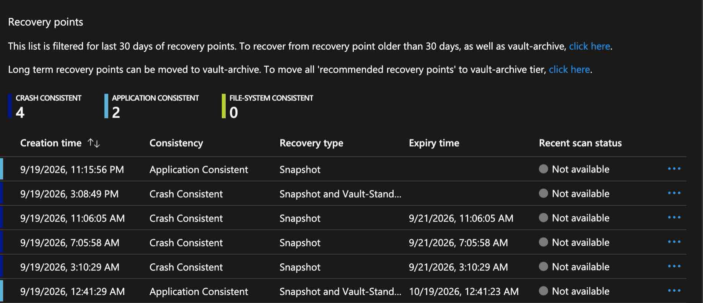
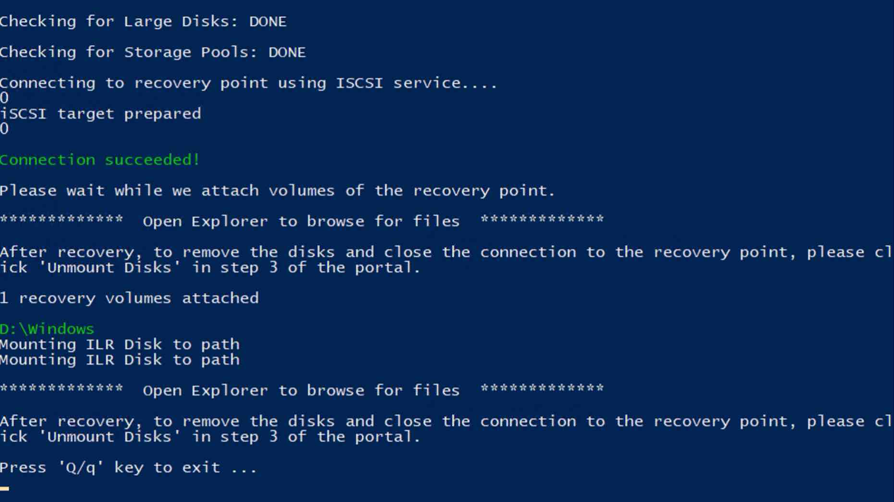
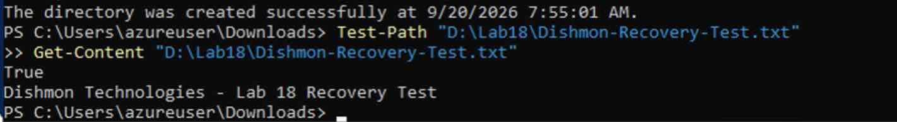
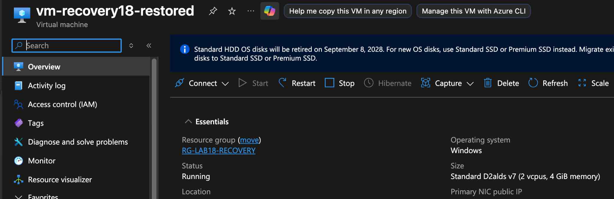

# Lab 18 – Azure Backup & Site Recovery

## Overview

This lab focused on **Azure Backup** and **Azure Site Recovery (ASR)** in the fictional **Dishmon Technologies** environment.

The lab covered both major sides of Azure business continuity:

- **Backup and recovery** — protecting a virtual machine, working with recovery points, recovering an individual file, and restoring a complete VM
- **Disaster recovery** — replicating a VM to another Azure region and performing a non-disruptive test failover

The goal was to practice the recovery decisions an Azure Administrator may need to make after accidental deletion, corruption, VM failure, or a regional outage.

---

## Objectives

- Configure VM backup using a Recovery Services vault
- Run and verify a manual backup
- Review available recovery points
- Understand crash-consistent and application-consistent recovery points
- Perform file-level recovery from a VM backup
- Verify recovered file contents
- Restore an entire virtual machine from backup
- Configure Azure Site Recovery replication
- Replicate a VM to another Azure region
- Perform a test failover without disrupting the source VM
- Verify source and test VMs in separate regions
- Clean up backup and replication resources safely

---

## Azure Services and Components

| Component | Purpose |
|---|---|
| Recovery Services vault | Stores and manages backup and disaster-recovery configuration |
| Azure Backup | Protects Azure VM data and provides recovery points |
| Recovery point | Point-in-time state used for file or VM recovery |
| File Recovery | Mounts recovery-point volumes for individual file restoration |
| Full VM Restore | Creates a restored VM from a selected recovery point |
| Azure Site Recovery | Replicates workloads for disaster recovery |
| Replicated item | VM protected by ASR replication |
| Test Failover | Creates an isolated test VM without affecting production replication |

---

## Lab Environment

The primary protected virtual machine was:

```text
vm-recovery18
```

The full-restore VM was:

```text
vm-recovery18-restored
```

The ASR test-failover VM was:

```text
vm-recovery18-test
```

The source workload ran in:

```text
Central US
```

The ASR test workload ran in:

```text
East US
```

---

## 1. VM Backup and Recovery Points

Azure Backup created multiple recovery points for `vm-recovery18`.

The recovery-point view showed both:

```text
Crash Consistent
Application Consistent
```

recovery points.



### Recovery Point Consistency

**Crash-consistent** recovery points preserve disk state at a point in time, similar to what would exist after an unexpected power loss.

**Application-consistent** recovery points also coordinate with applications so that application data is in a more consistent state when the backup is taken.

This distinction matters when selecting the most appropriate recovery point for a workload.

---

## 2. File-Level Recovery

The first recovery scenario assumed that the VM itself was healthy but a file needed to be recovered.

Instead of restoring the entire VM, **File Recovery** was used.

The Azure Backup recovery executable connected to the selected recovery point through iSCSI and attached the recovery volume to the VM.



The recovery process reported:

```text
Connection succeeded!
1 recovery volumes attached
```

This made the backup contents available for browsing without replacing the running VM.

---

## 3. Verify the Recovered File

The recovered file was verified with PowerShell.

The test confirmed that the path existed:

```powershell
Test-Path "D:\Lab18\Dishmon-Recovery-Test.txt"
```

Result:

```text
True
```

The file contents were then read successfully:

```text
Dishmon Technologies - Lab 18 Recovery Test
```



This proved that file-level recovery worked and demonstrated why a full VM restore would have been unnecessary for a single missing or damaged file.

---

## File Recovery Troubleshooting

The file-recovery process also provided a useful troubleshooting exercise.

An early attempt reported:

```text
Failed to download Item Level Recovery script.
```

Another attempt launched the recovery executable but failed because a required component could not be found:

```text
SecureTCPTunnel.exe
```

The recovery process was retried until the recovery-point connection completed successfully and the recovery volume mounted.

This reinforced an important administration lesson: a recovery feature being configured correctly does not guarantee that the recovery utility itself will complete successfully on the first attempt.

Verification of the mounted recovery volume and recovered file was therefore essential.

---

## 4. Full VM Restore

The second recovery scenario required restoring the entire virtual machine.

Azure Backup was used to create:

```text
vm-recovery18-restored
```

The restored VM reached:

```text
Running
```

state successfully.



### File Recovery vs. Full VM Restore

```text
Single file missing or damaged
        |
        v
Use File Recovery

VM itself damaged or unavailable
        |
        v
Use Full VM Restore
```

Choosing the smallest recovery operation that solves the problem avoids unnecessary disruption.

---

## 5. Azure Site Recovery Replication

Azure Site Recovery was configured to replicate the source VM to another Azure region.

The source workload remained in:

```text
Central US
```

while the disaster-recovery target was configured in:

```text
East US
```

ASR continuously maintains replicated workload data so a VM can be brought online in the target region when required.

### Backup vs. Site Recovery

Azure Backup and Azure Site Recovery solve different problems:

```text
Azure Backup
    |
    +--> Recovery points
    +--> File recovery
    +--> Full VM restore

Azure Site Recovery
    |
    +--> Cross-region replication
    +--> Failover
    +--> Disaster recovery testing
```

Backup is primarily about **recovering data or workload state**.

Site Recovery is primarily about **maintaining workload availability during a disaster**.

---

## 6. ASR Test Failover

A **Test Failover** was performed to validate the disaster-recovery configuration.

The result showed:

```text
vm-recovery18       Central US
vm-recovery18-test  East US
```

with both VMs running.


This demonstrated one of the most important ASR capabilities: a test failover validates recovery without interrupting the source VM or committing to a production failover.

The source workload remained untouched while the test VM was created in the recovery region.

---

## Business Continuity Decision Guide

| Scenario | Appropriate Recovery Action |
|---|---|
| One file was accidentally deleted | File Recovery |
| VM is damaged or must be rebuilt from backup | Full VM Restore |
| Need a point-in-time copy of VM data | Azure Backup recovery point |
| Need workload availability in another region | Azure Site Recovery |
| Need to validate DR without affecting production | ASR Test Failover |

---

## Recovery Services Vault

The **Recovery Services vault** acted as the management boundary for the backup and recovery configuration used in this lab.

For AZ-104, it is important to recognize that the vault is not simply a storage container. It manages protection-related configuration such as backup policies, protected VM items, recovery points, restore operations, Site Recovery configuration, replicated items, and recovery/failover workflows.

---

## Cleanup

After verification, the temporary disaster-recovery and backup configuration was removed in the proper order.

```text
Clean up test failover
        |
        v
Disable ASR replication
        |
        v
Stop/remove backup protection
        |
        v
Remove remaining temporary resources
```

Soft delete protection also had to be considered during cleanup because protected backup items cannot always be removed immediately while recovery protections remain enabled.

The lab resource groups were deleted after backup and replication protection had been removed.

---

## Key Lessons Learned

- Azure Backup and Azure Site Recovery serve different business-continuity purposes.
- A Recovery Services vault manages backup and disaster-recovery configuration.
- Recovery points provide selectable points in time for restoration.
- Application-consistent backups provide greater application awareness than crash-consistent backups.
- File Recovery is the appropriate choice when the VM is healthy and only individual files are needed.
- Full VM Restore is appropriate when the VM itself must be recovered.
- Recovery must be verified; successful configuration alone is not enough.
- File Recovery may require troubleshooting of the recovery utility before the recovery-point volume mounts successfully.
- ASR replicates workloads to a recovery region for disaster recovery.
- Test Failover validates recovery without disrupting the source VM.
- The source VM can remain running while an ASR test VM runs in another region.
- Test failover resources should be cleaned up after validation.
- Replication and backup protection must be removed before deleting some protected resources.
- Soft delete can affect backup cleanup workflows.

---

## AZ-104 Concepts Practiced

This lab reinforced Azure Administrator topics including:

- Recovery Services vaults
- Azure VM Backup
- Backup policies
- Manual backups
- Recovery points
- Crash-consistent backups
- Application-consistent backups
- File Recovery
- iSCSI recovery-point mounting
- Full VM Restore
- Backup verification
- Azure Site Recovery
- Replicated items
- Cross-region replication
- Test Failover
- Disaster recovery validation
- Soft delete
- Backup protection removal
- Replication cleanup
- Business continuity and disaster recovery

---

## Verification Results

The following objectives were successfully verified:

- VM backup protection configured
- Multiple recovery points available
- File Recovery recovery-point volume mounted
- Recovery-point connection succeeded
- Test file existed in the mounted recovery volume
- Recovered file contents were readable
- Full VM restore created `vm-recovery18-restored`
- Restored VM reached the running state
- ASR replication configured
- Test failover completed
- Source VM remained in Central US
- Test VM ran in East US
- Test failover cleaned up
- Replication disabled after testing
- Backup protection removed
- Temporary resource groups deleted

---

## Portfolio Evidence

1. **Backup Recovery Points**  
   Demonstrates available Azure VM recovery points and backup consistency types.

2. **File Recovery Volume Mounted**  
   Demonstrates successful connection to a recovery point and attachment of the recovery volume.

3. **File Recovery Verified**  
   Demonstrates successful recovery and validation of a specific file.

4. **Full VM Restore Running**  
   Demonstrates successful restoration of an entire Azure virtual machine.

5. **ASR Test Failover Regional VMs**  
   Demonstrates a non-disruptive Site Recovery test with the source VM in Central US and the test VM in East US.

---

## Repository Structure

```text
Lab-18-Azure-Backup-Site-Recovery/
├── README.md
└── screenshots/
    ├── 01-backup-recovery-points.png
    ├── 02-file-recovery-volume-mounted.png
    ├── 03-file-recovery-verified.jpg
    ├── 04-full-vm-restore-running.png
    └── 05-asr-test-failover-regional-vms.png
```
